# 树莓派alsa采集pcm小计

# 目录

1. [项目地址](#alsa001)
2. [软件和库安装](#alsa002)
    1. [库安装](#alsa002a) 
    2. [安装 audacity软件](#alsa002b)
     
3. [编辑 ~/.asoundrc](#alsa003)
    1. [编辑 asoundrc文件](#alsa003a)
    2. [其中`YouDeviceName`具体写什么?](#alsa003b)
     
4. [代码注意点](#alsa004)
5. [编译生成可执行文件](#alsa005)
6. [ffmpeg 或者 audacity 播放pcm](#alsa006)
    1. [6.1 ffmpeg播放](#alsa006a) 
    2. [6.2 audacity播放](#alsa006b)
7. [alsamixer麦克风相关配置](#alsa007)
8. [相关命令](#alsa008)
9. [参考资料](#alsa009)


### alsa001
# 1. 项目地址

https://github.com/coderTong/raspberrypi_alsa_pcm

### alsa002
# 2. 软件和库安装

### alsa002a
## 2.1 库安装

```shell

sudo  apt-get  install  libasound2

sudo  apt-get  install  libasound2-dev

sudo  apt-get  install  libv4l-dev

sudo  apt-get  install  libx264-dev

sudo  apt-get  install  vim

sudo  apt-get  install  build-essential


sudo apt-get install libasound2 libasound2-dev libv4l-dev libx264-dev  vim build-essential -y

```


### alsa002b
## 2.2 安装 audacity软件

```c

sudo  apt  install  audacity

```


### alsa003
# 3. 编辑 ~/.asoundrc

### alsa003a
## 3.1 编辑 asoundrc文件

0. 进入文件夹 cd ~

`.asoundrc`是隐藏文件, 需要`ls -a` 才能看到

1. 先备份原来的文件
```c

cp .asoundrc .asoundrcOriginal20200714

```

2. 编辑`.asoundrc`,将原来内容替换为如下

```c

pcm.usb
{
    type hw
    card YouDeviceName
}

pcm.!default
{
    type asym
    playback.pcm
    {
        type plug
        slave.pcm "dmix"
    }
    capture.pcm
    {
        type plug
        slave.pcm "usb"
    }
}


```


### alsa003b
## 3.2 其中`YouDeviceName`具体写什么?

1. 在`Terminal` 敲密令` arecord -l `


如上图, 红线标记处, 我的树莓派插了两个麦克风, 一个叫`Device`, 一个叫`Camera`, 我就可以随便选择一个.

- 如果我选择`Device`, 那配置文件就写成如下

```c


pcm.usb
{
    type hw
    card Device
}

pcm.!default
{
    type asym
    playback.pcm
    {
        type plug
        slave.pcm "dmix"
    }
    capture.pcm
    {
        type plug
        slave.pcm "usb"
    }
}


```

- 如果我选择`Camera`, 那配置文件就写成如下

```c


pcm.usb
{
    type hw
    card Camera
}

pcm.!default
{
    type asym
    playback.pcm
    {
        type plug
        slave.pcm "dmix"
    }
    capture.pcm
    {
        type plug
        slave.pcm "usb"
    }
}


```


### alsa004
# 4. 代码注意点

1. 设备配置

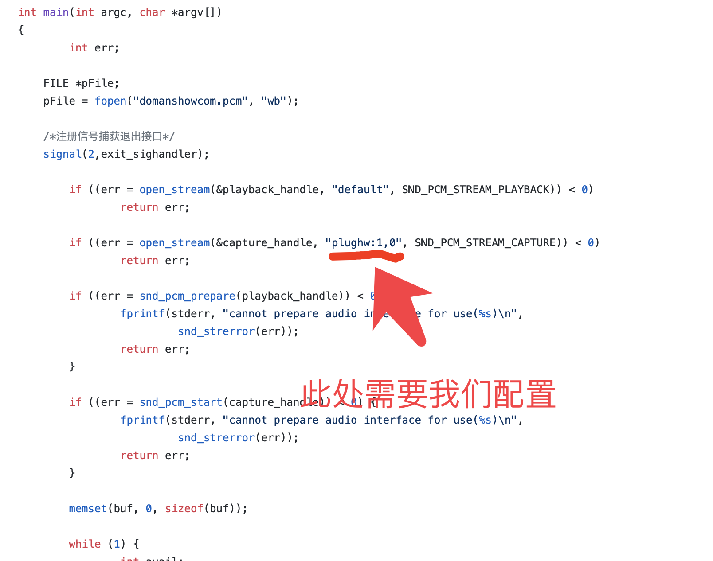

根据我们配置的`asoundrc`我需要使用`plughw:1,0`这种打开设备, 还是看图

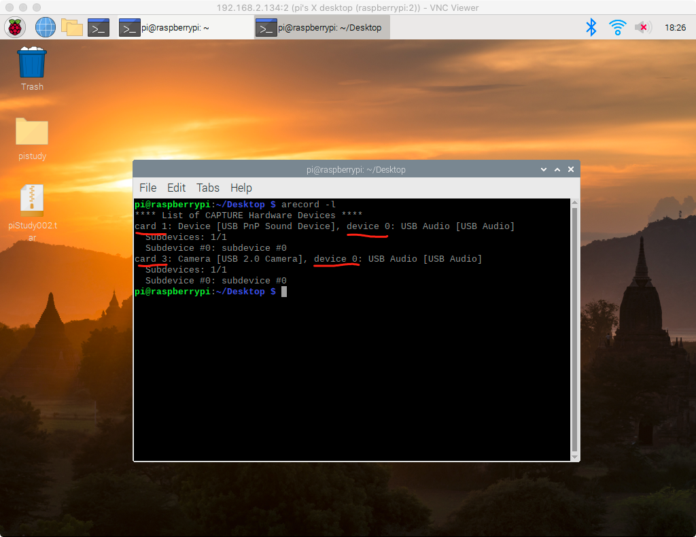
- 如果我们配置文件配的是`Device`,  如图`Device`是`card 1`, `device 0`, 所以代码中我就得写`plughw:1,0`
- 如果我们配置文件配的是`Camera`,  如图`Camera`是`card 3`, `device 0`, 所以代码中我就得写`plughw:3,0`

2. 采集参数


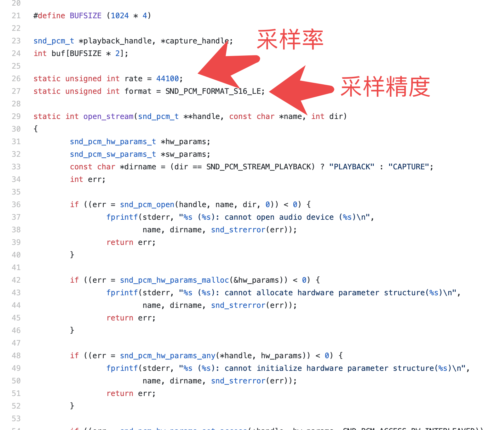
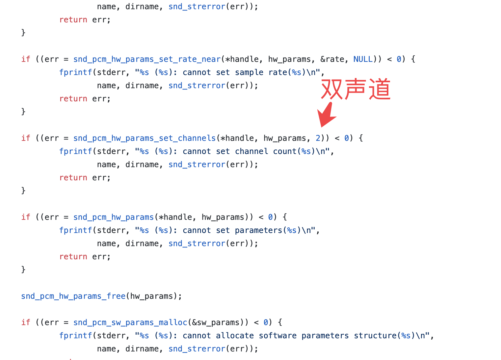

3. 录音根据系统信号停止`ctrl + c`停止(stop)

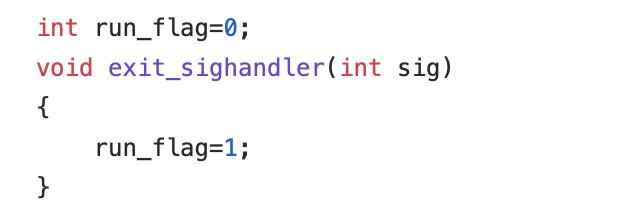
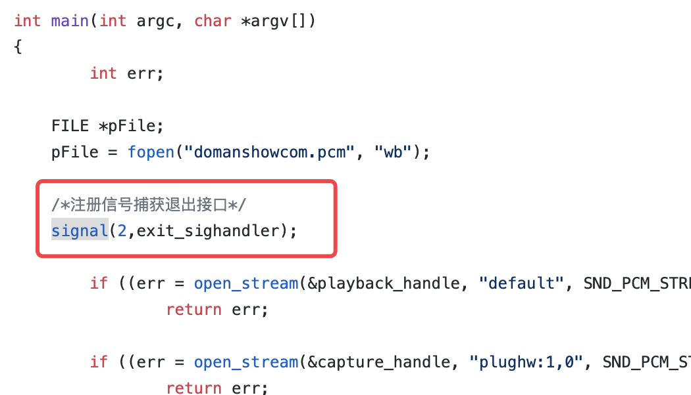
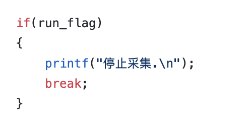


### alsa005
# 5. 编译生成可执行文件
没有`gcc`的先装`gcc`, 我的树莓派系统里自己有的哈

1. 进入`loop.c`代码所在文件夹 `cd 代码文件夹`
2. 编译`gcc -Wall -o  alsa  loop.c -lasound`
3. 执行`./alsa`
4. 停止录音`ctrl + c`


### alsa006
# 6. ffmpeg 或者 audacity 播放pcm

### alsa006a
## 6.1 ffmpeg播放

上面说了我使用的是
- 采样率: `44100`
- 采样精度: `SND_PCM_FORMAT_S16_LE`
- 声道: `2`

所以我们`ffmpeg`播放命令就是如下
1. 进入pcm文件
2. 执行命令`ffplay -ar 44100 -channels 2 -f s16le -i ./domanshowcom.pcm`

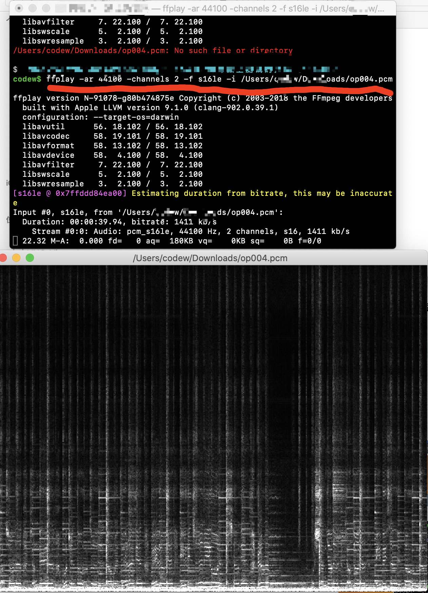
### alsa006b
## 6.2 audacity播放

1. 打开audacity软件
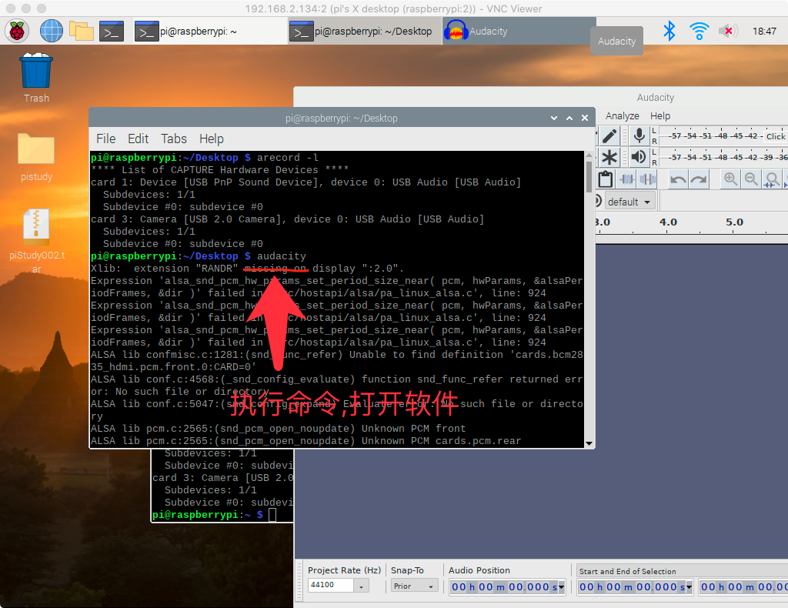

2. audacity软件打开pcm文件
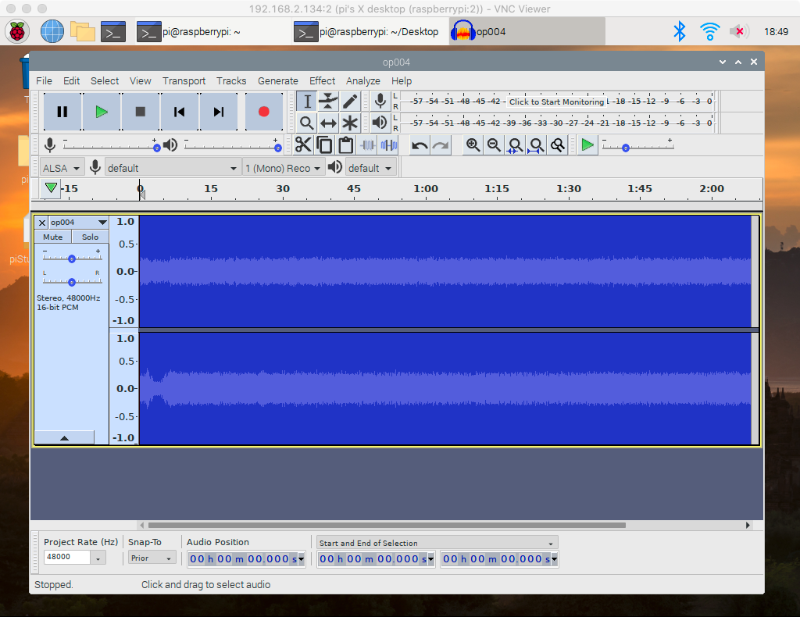


### alsa007
# 7. alsamixer麦克风相关配置

如果录音声音小, 或者全是噪音什么的. 用`alsamixer`调节一下麦克风

1. 打开`alsamixer`软件

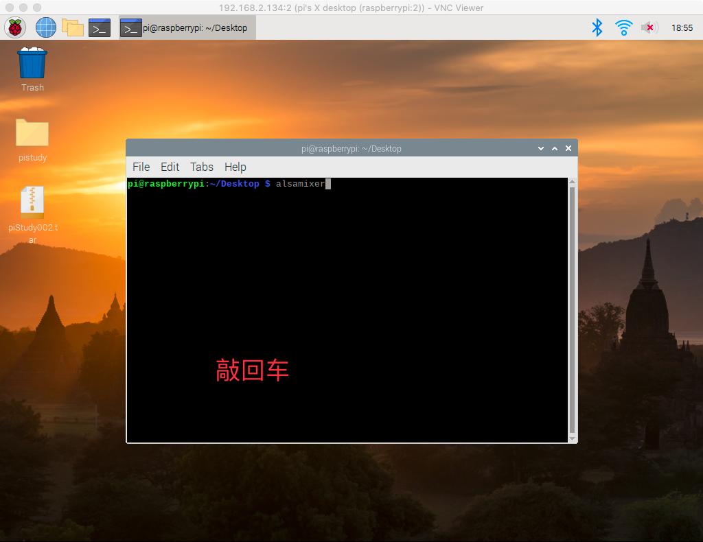
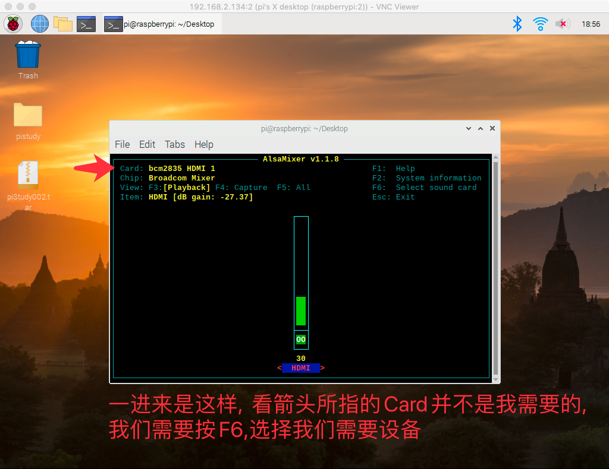

2. 按F6选择麦克风设备

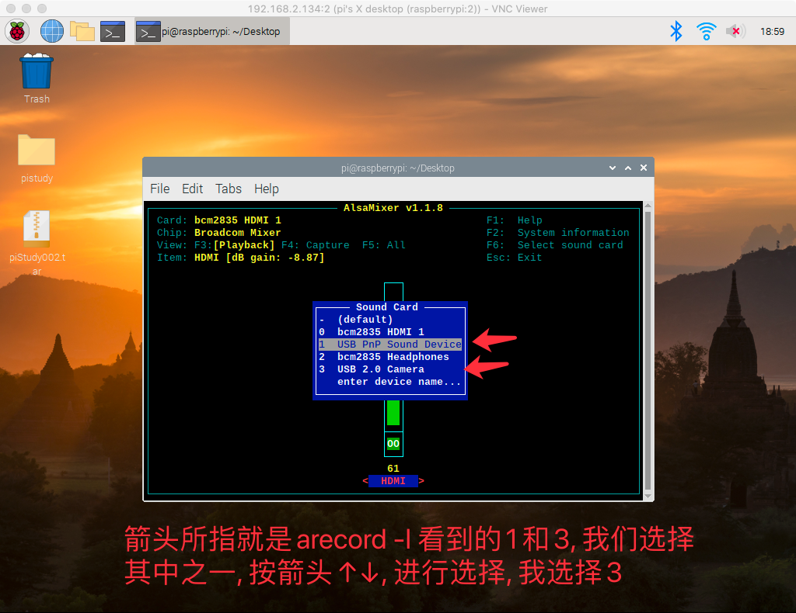
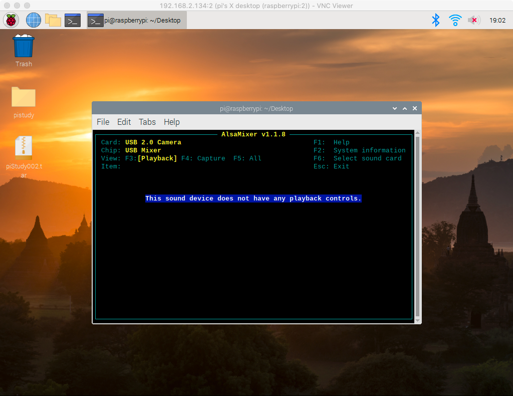

3. 按F4对麦克风参数配置

进入此界面后呢, 就可以按↑↓键,调节麦克风
我是调节到麦克风最大强度100, 如果是0,
采集到的声音就会有问题
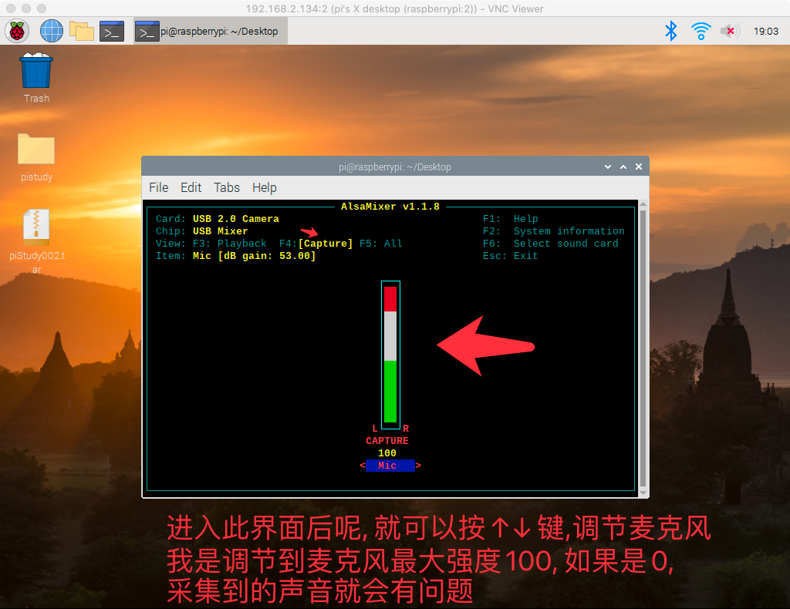


### alsa008
# 8. 相关命令

- alsamixer
- aplay -l
- arecord -l
- gcc -Wall -o  alsa  loop.c -lasound
- lsusb
- sudo  apt  install  audacity
- audacity


### alsa009
# 9. 参考资料


- [Advanced Linux Sound Architecture (简体中文)设置默认的麦克风/录音设备](https://wiki.archlinux.org/index.php/Advanced_Linux_Sound_Architecture_(%E7%AE%80%E4%BD%93%E4%B8%AD%E6%96%87)#%E8%AE%BE%E7%BD%AE%E9%BB%98%E8%AE%A4%E7%9A%84%E9%BA%A6%E5%85%8B%E9%A3%8E/%E5%BD%95%E9%9F%B3%E8%AE%BE%E5%A4%87)

- [ALSA project - the C library reference](https://www.alsa-project.org/alsa-doc/alsa-lib/group___p_c_m.html)

- [PCM数据格式](https://blog.csdn.net/ownWell/article/details/8114121)

- [pcm音量计算](https://blog.csdn.net/freeze_z/article/details/44310245)

- [一个项目](https://github.com/jjzhang166/aicontroler/blob/3ae32c384f80ada5e2b6029f2ed5e7509a08c4a2/aicontroler/src/record.c)

- [alsa_play_and_record](https://github.com/zbengang/alsa_play_and_record)

 - https://github.com/zbengang/alsa_play_and_record/blob/4762e50eaa4cdf9cf79f8328fb52040cd08cd3f5/test_rec.c#L12

- [alsa-record-on-raspberrypi](https://github.com/nicktcl/alsa-record-on-raspberrypi)
- https://blog.csdn.net/xiaolong1126626497/article/details/105718239/

- [Linux下使用alsamixer配置系统默认的声卡设备(默认音频输出设备、输入设备、系统音量)](https://blog.csdn.net/xiaolong1126626497/article/details/105718239/)

- [ALSA Programming HOWTO](https://users.suse.com/~mana/alsa090_howto.html)


