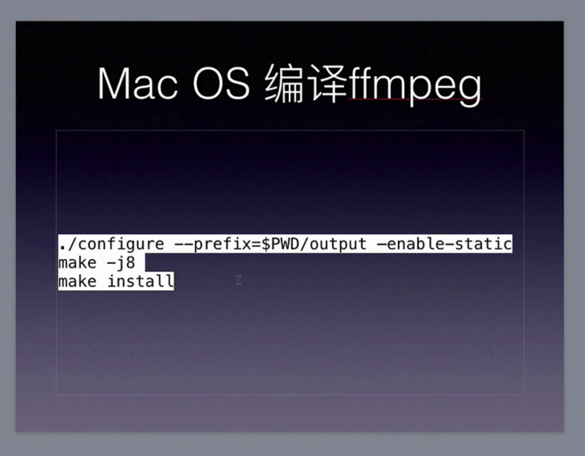
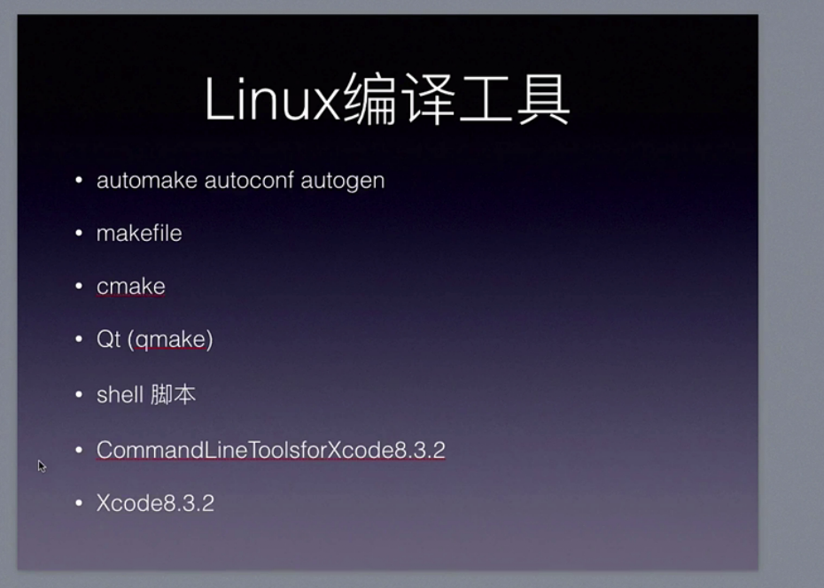
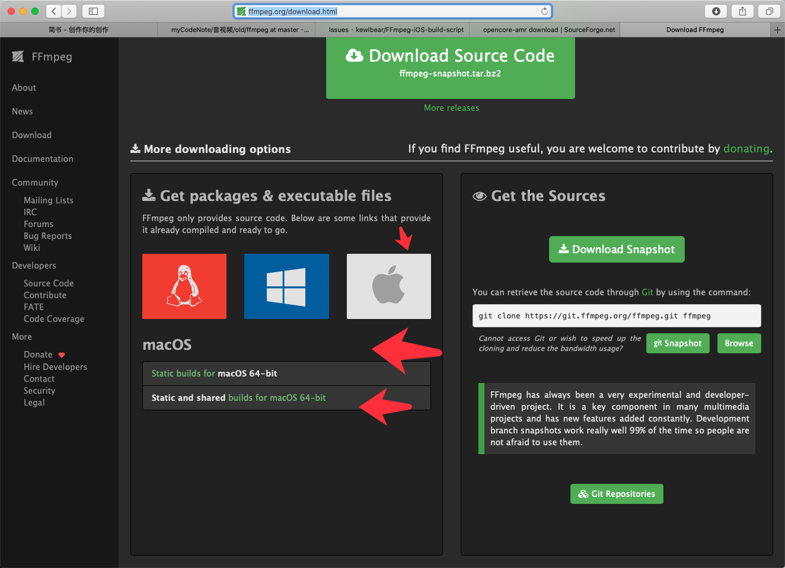
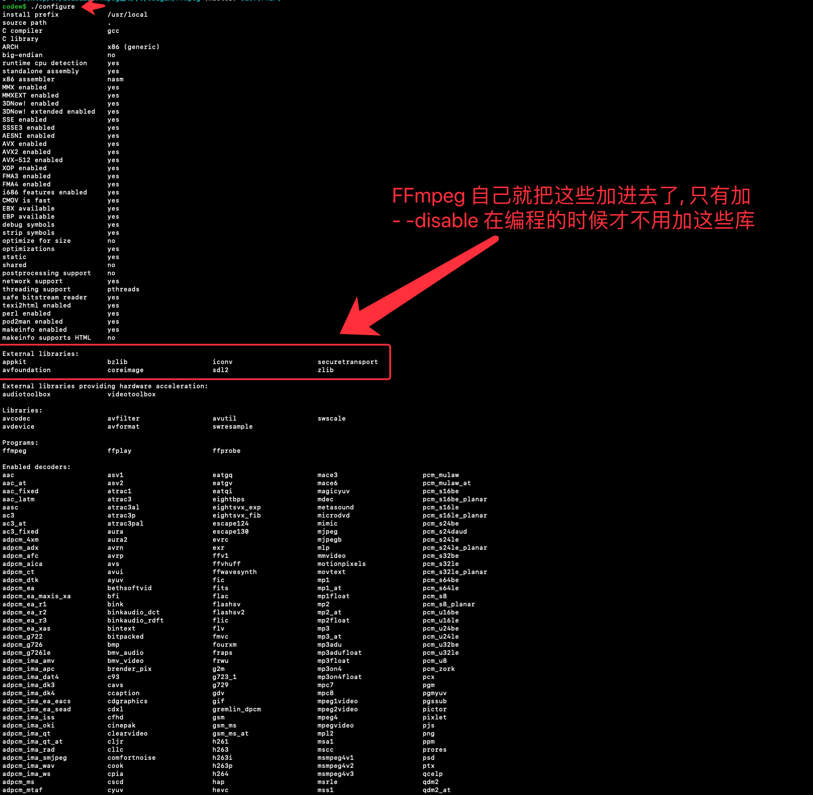
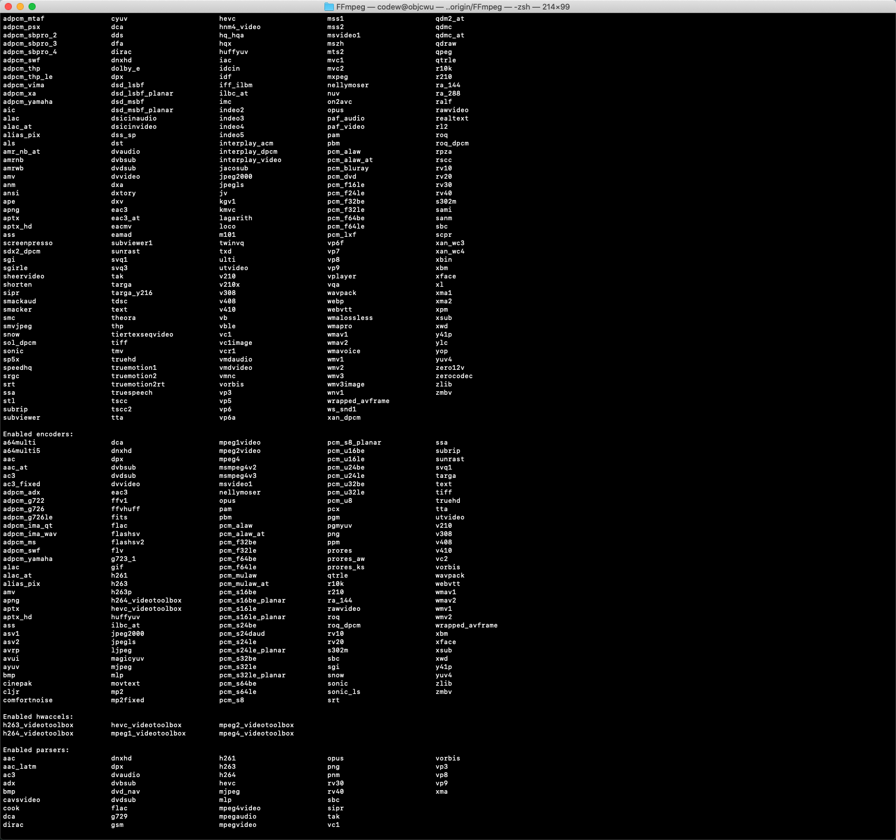
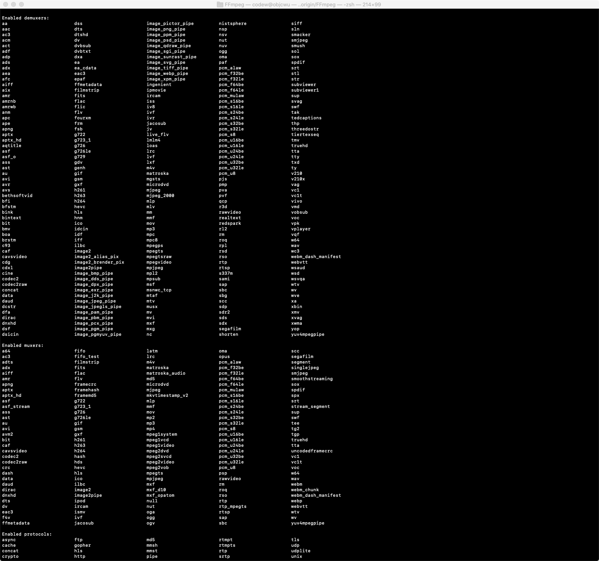
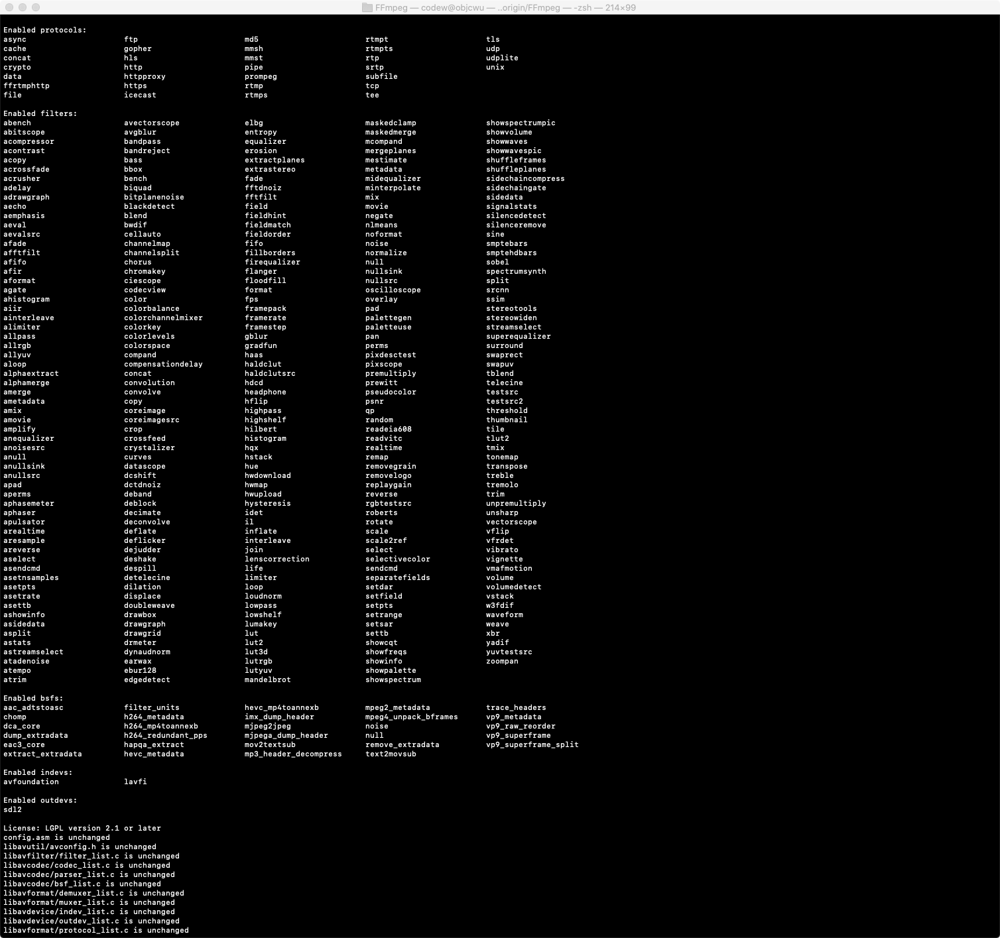
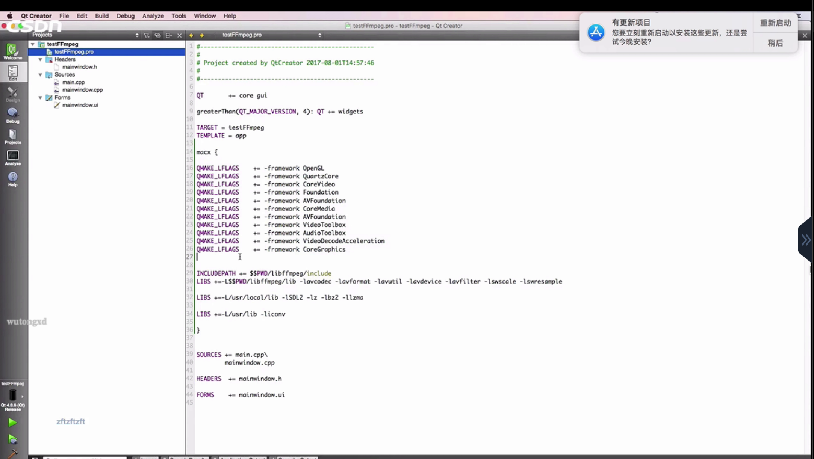
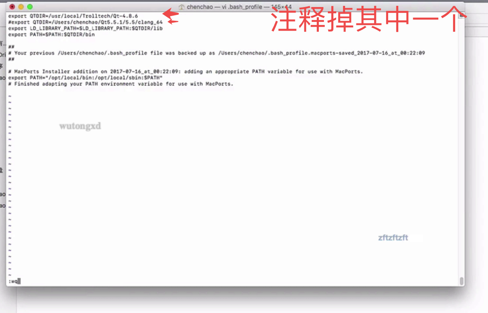

# 编译FFmpeg


# 1. 编译给iOS

见上一个小结


# 2. 编译x86

见`old/ffmpeg/ffmpeg从入门到精通学习笔记/第01部分FFmpeg的命令行使用篇/01-FFmpeg简介/01-FFmpeg简介.md`


## 2.1 简单版

进入FFmpeg源码文件
```

cd FFmpeg

```

configure
```

./configure --prefix=$PWD/output --enable-static

```

make
```c

make -j8

```


上面这样的话哈, 就是电脑是什么样的,编译出来的就是适应这个电脑的FFmpeg



# 3. 直接下载, 官方编译好的

http://ffmpeg.org/download.html




# 4.什么是交叉编译

交叉编译就是x86的电脑给arm平台编译可用的执行文件


# 5. make -j

j后面加数字, 就是开启多少个线程
make -j8 就是开启8个线程去编译

取决你电脑的cpu


# 6. 编译后为什么要加那些库文件










# 7. qt 工程转xcode工程命令

```

qmake -spec macx-xcode testffmpeg.pro

```


# 8. 电脑装了多个qt, 转出xcode工程出错, 修改qt版本

```c

cd ~


vim .bash_profile

```




