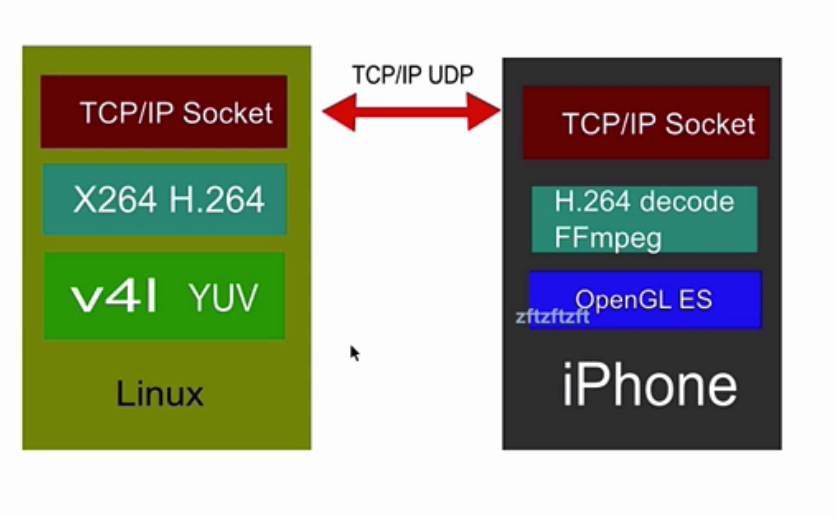
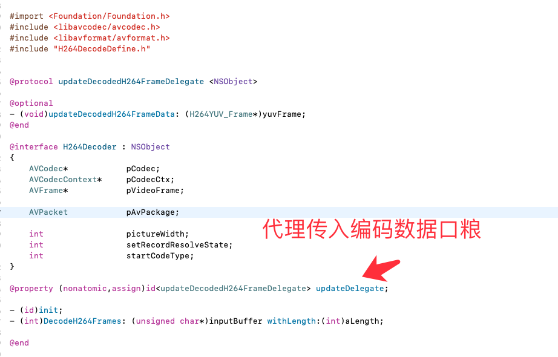
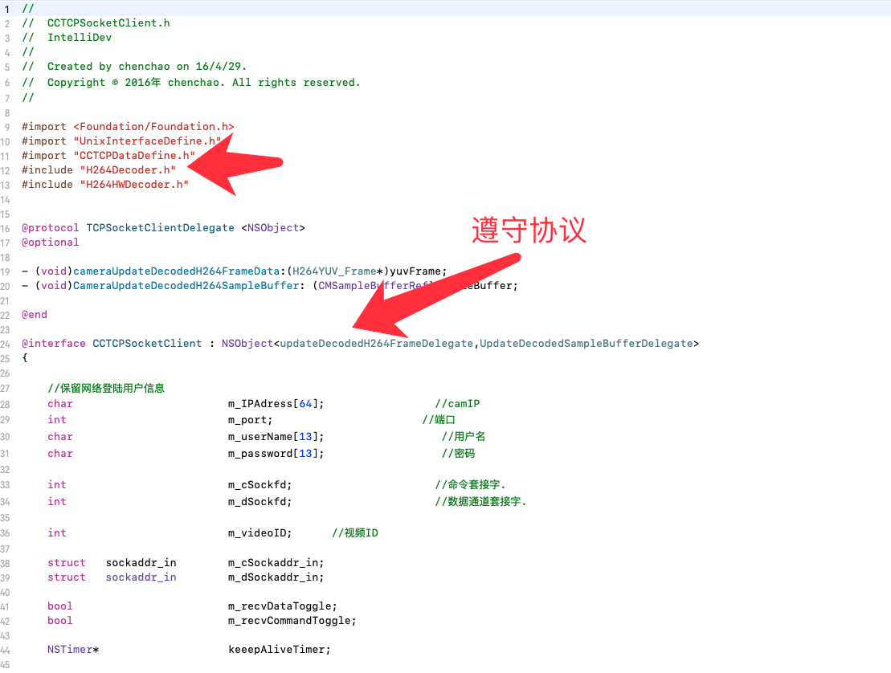
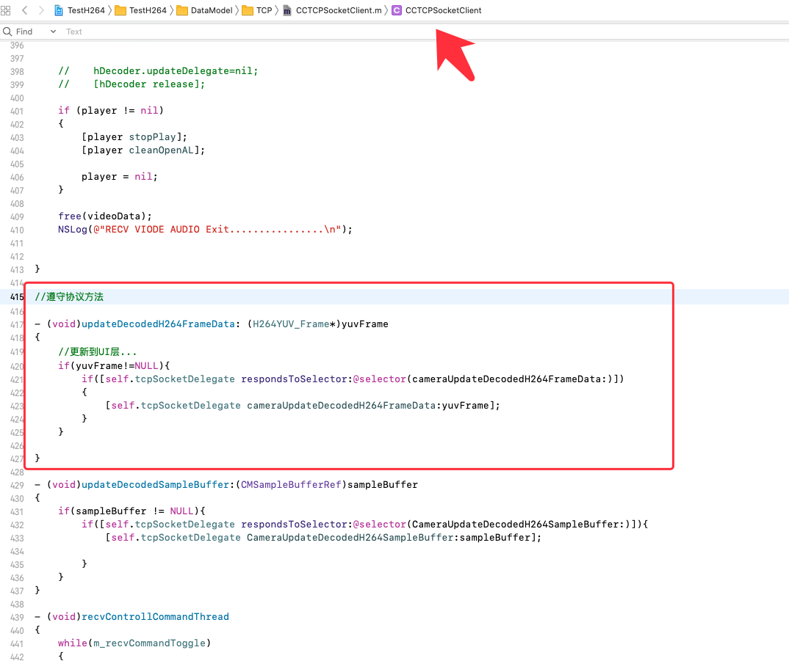
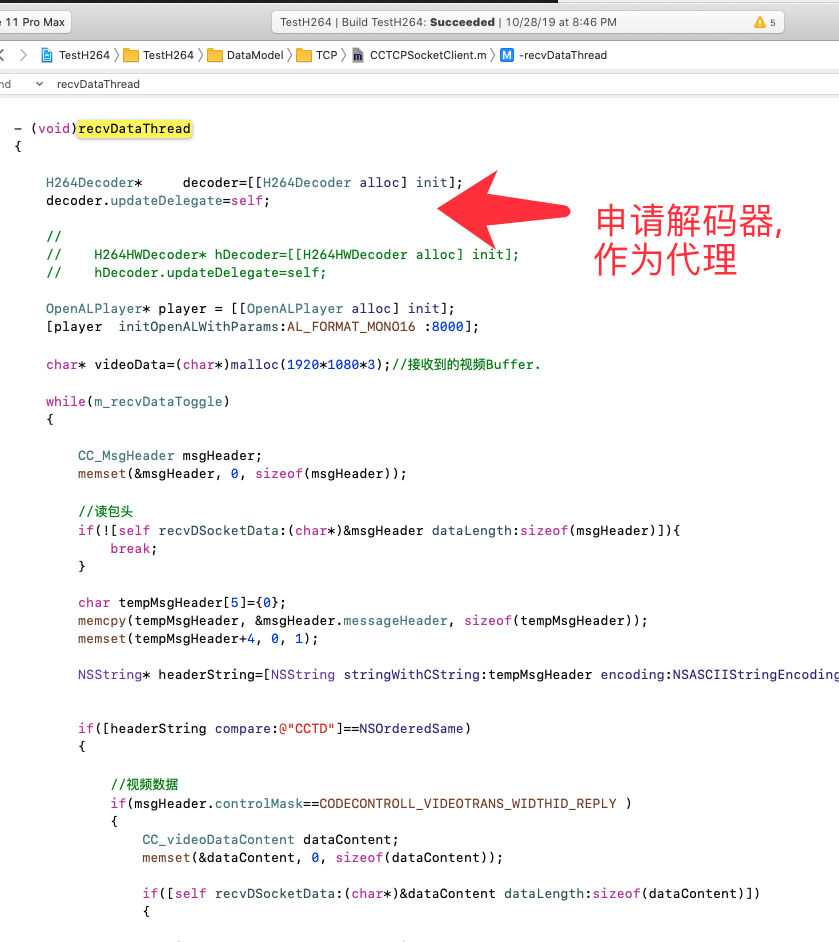
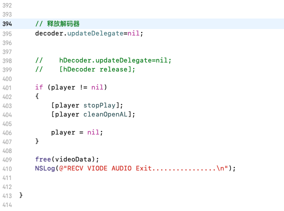
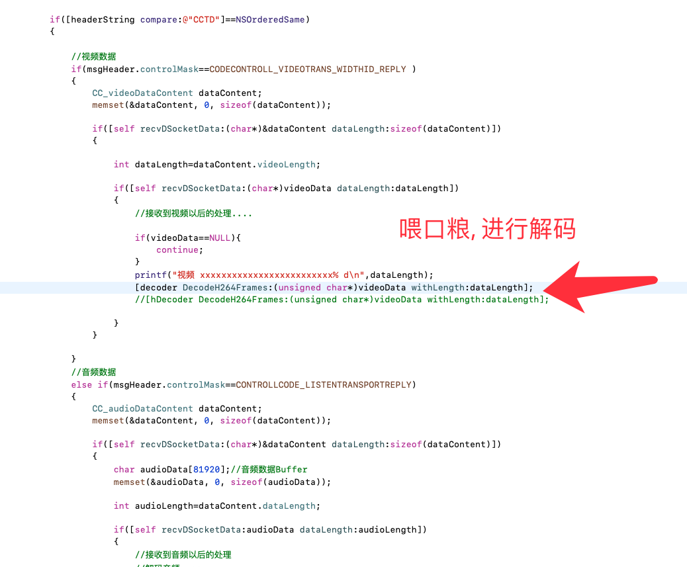

目录
1. [](#)
2. [](#)

- Video16: 对应视频:`016. 04 H.264 视频数据接收_recv`
- Video17: 对应视频:`017. 05 解码H.264数据 1_recv`
- Video18: 对应视频:`018. 06 解码H.264数据2_recv`
- Video19: 对应视频:`019. 07 解码H.264数据3_recv`

# 解码H.264数据


### h26401
# 1. 开发环境搭建

## 1.1Ubuntu 

1. 安装VMware-tools(如果是虚拟机的话)
2. 安装gcc
3. sudo apt-get update
4. sudo apt-get install vim
5. sudo apt-get install build-essential

v4l
6. sudo apt-get install libv4l-dev
x264
7. sudo apt-get install libx264-dev


# 2. h.264 视频数据接收 Video16


这一节基本上就是在linux端把采集程序开启了一下

然后用xcode跑了一下iOS程序.  在iOS项目里就配了一下端口和ip

没有说具体技术点

1. 进入linux服务器
2. 进入代码文件夹
3. make clean
4. make
5. 生成了可执行文件
6. 运行可执行文件


# 3. 解码h264数据


## 3.1 嵌入式linux( Embeded linux ) Video17

1. v4l说采集的图像是yuv

2. 嵌入式linux说不能做硬件编码, 但是教程用的是虚拟机等于用的是pc的cpu所以就可以用x264.而我用的是树莓派高配所以也用x264

3. x264将yuv编码成H.264

4. 最后将h.264 通过TCP/IP Socket 发出去

## 3.2 iOS端 Video17

1. 通过TCP/IP Socket收到数据
2. 通过FFmpeg解码
3. openglES 渲染

## 3.3 架构图 Video17




## 3.4 iOS项目编写解码器 Video17

写了一个解码类的开头

```objc

@interface  H264Decoder : NSObject

{

 AVCodec* pCodec;

 AVCodecContext*  pCodecCtx;

 AVFrame* pVideoFrame;

 AVPacket pAvPackage;

}

```


# 3.5 代码讲解 Video18

代码地址:`https://gitee.com/wutongxd/avCameraiOS`

1. 001yuv三个分量取值为什么要取较小的值的原因
2. 002yuv三个分量取值为什么要取较小的值的原因

`>`计算机类知识啥的`>`音视频学习`>`FFmpeg`>`001解码h26..

链接: https://pan.baidu.com/s/1rzHbFLui2FOndrZkMLR15g 提取码: 3ni4 复制这段内容后打开百度网盘手机App，操作更方便哦

链接: https://pan.baidu.com/s/1F-TljlT7o5r1DNxngq6eVw 提取码: 59bh 复制这段内容后打开百度网盘手机App，操作更方便哦


讲解了下解码的步骤


## 3.5.1 没有shader,可以用 sw_scale()函数转RGB ,但是这个函数是很消耗资源的


# 3.6 解码类继续讲解 Video19

解码器获取口粮方法 


1.  通讯类`CCTCPSocketClient`
- 在它下面接收到音视频网络编码数据
- `recvDataThread`方法获取视频数据
- 让他做解码器的代理, 让他喂口粮给解码器类
- 遵守协议


- 申请解码器并自己作为代理

- `recvDataThread`方法循环结束释放解码器


- 喂口粮进行解码



# 4. OpenGL ES 渲染YUV图像


