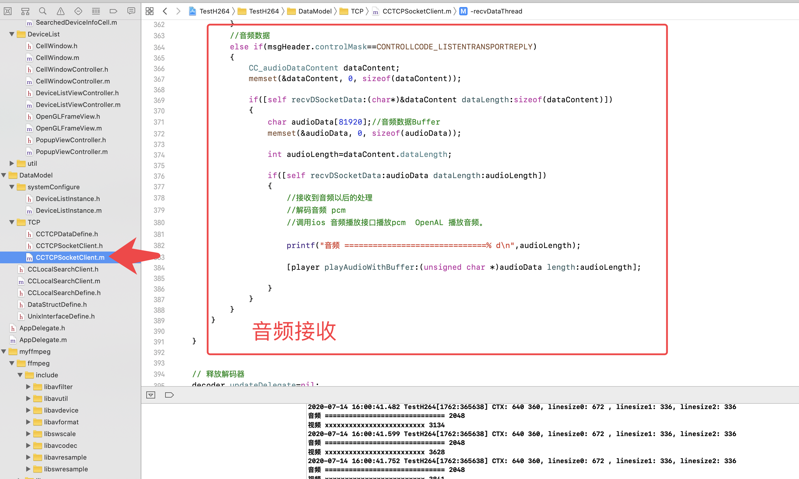
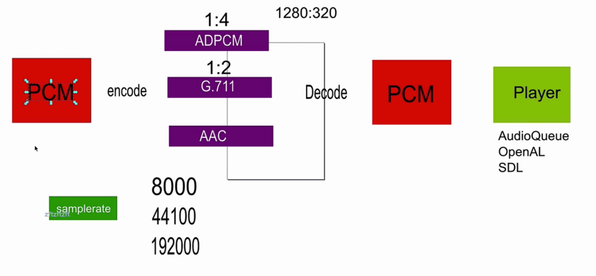

# 

- Video21: 对应视频:`021. 09 音频采集接收_recv`
- Video22: 对应视频:`022. 10 音频编解码_recv`

Video21
# 1. 对github`simple-alsa-loop`项目讲解

使用这个库, 进行pcm写文件讲解

树莓派见我的改进版项目
[raspberrypi_alsa_pcm](https://github.com/coderTong/raspberrypi_alsa_pcm)

视频里将这个采集项目改版后,集成到[采集项目](https://gitee.com/wutongxd/avcamera/tree/master/code)socket, 只能用8000, linux里只能用这个采样率才能播出相对不错的效果, 我试了下44100确实听这个不行.(我用的是树莓派4b)

但是你单纯用[raspberrypi_alsa_pcm](https://github.com/coderTong/raspberrypi_alsa_pcm)这个写文件呢,又是可以的效果.....

# 2. 音频接收地点
`CCTCPSocketClient`类.....

# 3. 音频编码解码

大概就看了几个文件,说说iOS 怎么采集pcm什么的

就介绍了
AudioCollector. 这个类

