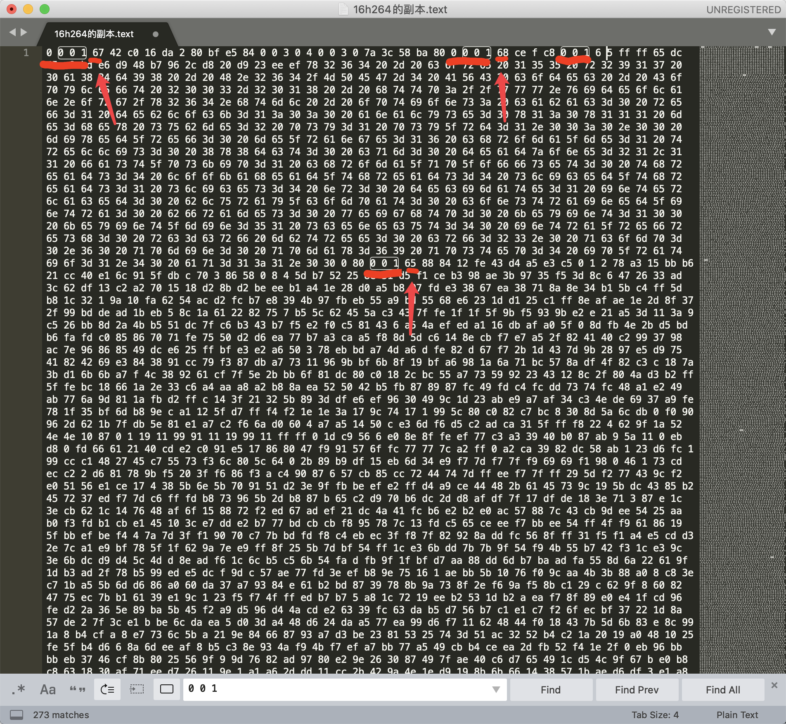
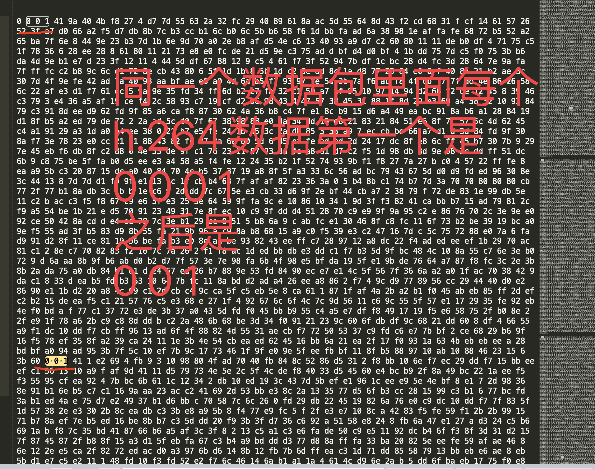

# h.264  帧介绍

# 1. 三种帧的说明

## 1. 1 I 帧概念
- I帧: 帧内编码帧，I帧表示关键帧，你可以理解为这一帧画面的完整保留;解码时只需要本帧数据就可以完成(因为包含完整画面)

## 1.2 I帧特点:

1. 它是一个全帧压缩编码帧。它将全帧图像信息进行JPEG压缩编码及传输;
  
2. 解码时仅用`I帧`的数据就可重构完整图像;

3. `I帧`描述了图像背景和运动主体的详情;

4. `I帧`不需要参考其他画面而生成;

5. `I帧`是`P帧`和`B帧`的参考帧(其质量直接影响到同组中以后各帧的质量);

6. `I帧`是`帧组GOP`的`基础帧`(`第一帧`),在`一 组`中只有一个`I帧`;

7. `I帧`不需要考虑运动矢量;

8. `I帧`所占数据的信息量比较大。

## 1.3 B帧概念

- `B帧`: `双向预测`内插编码帧。
- `B帧`是`双向差别帧`，也就是B帧记录的是**本帧与前后帧的差别**(具体比较复杂，`有4种情况`，但我这样说简单些).
- 换言之，要解码`B帧`，`不仅`**要**取得`之前`的缓存画面，**还要**解码`之后`的画面，通过`前后`画面的与`本帧数据`的`叠加`取得最终的画面。B帧压缩率高，但是解码时CPU会比较累。

## 1.4 B帧的预测与重构

- `B帧`以**前面**的`I`或`P帧`和**后面**的`P帧`为参考帧.

- **找出**`B帧`**某点**的`预测值`和两个`运动矢量`, 并取预测差值和运动矢量传送。
- 接收端根据运动矢量在两个参考帧中 **找出(算出)** 预测值并与差值求和，得到B帧**某点**样值，从而可得到完**整**的`B帧`。

## 1.5 B帧特点

1. `B帧`是由`前面`的`I`或`P帧`和**后面**的`P帧`来进行预测的;

2. `B帧`**传送**的是它与**前面**的`I`或`P帧`和**后面**的**P帧**之间的`预测误差`及`运动矢量`;

3. `B帧`是`双向预测编码帧`;

4. `B帧`**压缩比最高**,因为它只反映丙参考帧间运动主体的变化情况，预测比较准确;

5. `B帧`**不是**`参考帧`，**不会**`造成``解码错误`的`扩散`。

### PS
`I`, `B`, `P` 各帧是根据压缩算法的需要, 是人为定义的, 它们都是实实在在是物理帧.
一般来说, 
- `I帧` 的压缩率是`7` (跟JPG差不多)
- `P帧` 的压缩率是`20`
- `B帧` 的压缩率可以达到`50`

可见使用B帧能节省大量空间, 节省出来的空间可以用来保存多一些`I帧`, 这样在相同码率下, 可以提供更好的画质.

## 1.6 P帧概念

- `P帧`:  `前向预测`**编码帧**.
- `P帧`表示的是这一帧跟`之前`的`关键帧`(或`P帧`)的差别,  `解码时`需要用`之前`缓存的画面叠加上本帧定义的差别, 生成最终画面.
- 也就是差别帧, `P帧`**没有**`完整的画面`数据, **只有**与前一帧的画面`差别数据`

## 1.7 P帧的预测与重构

`P帧的预测与重构`:
- `P帧`是以`I帧`为`参考帧`，在`l帧`中找出`P帧`**某点**的`预测值`和`运动矢量`，取`预测差值`和`运动矢量`一起传送。
- `在接收端`**根据**`运动矢量`从`I帧`中找出`P帧``某点`的`预测值`**并与**`差值`**相加**以得到`P帧`**某点**样值，从而可得到完整的P帧。

## 1.8 P帧特点:

1. `P帧`是`I帧`**后面**相隔1~2帧的编码帧;

2. `P帧`采用`运动补偿`的方法**传送**它与**前面**的`I`或`P帧`的**差值**及**运动矢量(预测误差);**

3. 解码时必须将`I帧`中的`预测值`与`预测误差`**求和**后才能重构完整的**P帧**图像;

4. `P帧`属于`前向预测`的`帧间编码`。它`只参考`**前面**`最靠近它`的`l帧`或`P帧`;

5. `P帧`**可以**是其**后面**`P帧`的参考帧，**也可以**是其`前后`的`B帧`的参考帧;

6. 由于`P帧`是参考帧，`它可能`造成`解码错误的扩散`;

7. 由于是**差值传送**，`P帧`的压缩比较高。

## 1.9 h264的压缩方法

1. `分组`: 把几帧图像分为一组(`GOP,` 也就是一个序列), 为防止运动变化, 帧数不宜取多
2. 定义帧: 将`每组`内各帧图像`定义为`**三种类型**, 即`I帧`, `B帧`和`P帧`
3. 预测帧: 以`I帧`做为基础帧, 以`I帧`预测`P帧`, 再由`I帧`和`P帧`预测B帧
4. 数据传输: 最后将`I帧`数据与`预测的差值信息`进行存储和传输

- `帧内(Intraframe) 压缩`也称为`空间压缩(Spatial compression)`当压缩一帧图像时，仅考虑本帧的数据而`不考虑相邻帧`之间的`冗余信息`，这实际上与静态图像压缩类似。`帧内`一般采用`有损压缩`算法，由于帧内压缩是编码一个完整的图像，所以可以独立的解码、显示。帧内压缩一般达不 到很高的压缩，跟编码jpeg差不多。

- `帧间(Interframe) `压缩的原理是:`相邻几帧`的数据有很大的`相关性`，或者说`前后两帧`信息变化很小的特点。也即连续的视频其相邻帧之间具有冗余信息根据这一特性， 压缩相邻帧之间的冗余量就可以进一步提高压缩量，减小压缩比。帧间压缩也称为`时间压缩(Temporal compression)`，它通过比较时间轴上不同帧之间的数据进行压缩。`帧间`压缩一般是`无损的`。`帧差值(Frame differencing)`算法是一 种典型的时间压缩法，它通过比较本帧与相邻帧之间的差异，仅记录本帧与其相邻帧的差值，这样可以大大减少数据量。

- 顺便说下`有损(Lossy )压缩`和`无损(L ossy less)压缩`。`无损压缩`也即`压缩前`和`解压缩后`的数据`完全一致`。多数的无损压缩都采用`RLE行程编码`算法。`有损压缩`意味着`解压缩后`的数据`与压缩前的数据不一致`。在压缩的过程中要丢失一些人眼和人耳所不敏感的图像或音频信息，而且丢失的信息不可恢复。几乎所有`高压缩的算法`**都**`采用`**有损压缩**这样才能达到低数据率的目标。丢失的数据率与压缩比有关压缩比越小，丢失的数据越多，解压缩后的效果一般越差。此外，某些有损压缩算法采用多次重复压缩的方式，这样还会引|起额外的数据丢失。

# 1.10 H.264NAL头解析

为了进行网络传输就有了NAL

- 如果`NALU`对应的`Slice`为一帧的**开始**,  **则**用`4个字节`表示, 即`0x00 00 00 01`; **否则**用`3字节`表示, `0x 00 01`

- **NAL header**: 
    - `forbidden_bit`, 
    - `nal_reference_bit`(优先级) 2bit,
    - `nal_unit_type`(类型) 5bit

标识`NAL单元`中的`RBSP`类型, 其中`nal_unit_type` 取值为`1,2,3,4,5`的`NAL单元`称为`VLC的NAL单元`, 其他类型的`NAL单元`为`非VLC`的`NAL单元`

- `0`:未规定
- `1`:非IDR图像中不采用数据划分的片段
- `2`:非IDR图像中A类数据划分片段
- `3`:非IDR图像中B类数据划分片段
- `4`:非IDR图像中C类数据划分片段
- `5`: IDR图像的片段
- `6`:补充增强信息(SEI)

- `7`: **序列参数集(SPS)** ----重点
- `8`: **图像参数集(PPS)** ----重点

- `9`:分割符
- `10`:序列结束符
- `11`:流结束符
- `12`:填充数据
- `13`:序列参数集扩展
- `14`:带前缀的NAL .单元
- `15`:子序列参数集
- `16- 18`:保留
- `19`:不采用数据划分的辅助编码图像片段20:编码片段扩展
- `21-23`:保留
- `24 - 31`:未规定

# 1.11 SPS和PPS

`H.264`的`SPS`和`PPS串`, 包含了`初始化H.264`**解码器**所需要的信息**参数**, 包括**编码**所用的`profile`, `level`, `图像的宽和高`, `deblock滤波器`等.

码率: 256~512 kb/s
帧率: 15~20 fps
分辨率: `1280x720(HD)`,  `640x368(VGA)`, `1920x1080(UHD)`

# 1.12  h264常见的帧头数据

  h264常见的帧头数据为：

- 00 00 00 01 67    (`SPS`)

- 00 00 00 01 68    (`PPS`) 

- 00 00 00 01 65    ( `IDR 帧`) 

- 00 00 00 01 61    (`P帧`)

# 1.13 h264数据说明

`0 0 0 1` 或者 `0 0 1` 是每个264的开头 后面的一个字节是 `NAL头` 入图中紧跟着的 `41` `67` `68` `65` 这都是16进制, 我是要将它们转成二进制来看

16进制的`68`转二进制为`0 1 1 0 1 0 0 0`
16进制的`67`转二进制为`0 1 1 0 0 1 1 1`
16进制的`65`转二进制为`0 1 1 0 0 1 0 1`
16进制的`41`转二进制为`0 1 0 0 0 0 0 1`

第一位 为F
第2-3位 为NRI
第4-8位为Type

- F：禁止为，0表示正常，1表示错误，一般都是0

- NRI：重要级别，11表示非常重要。

- TYPE：表示该NALU的类型是什么，见下表7.20，由此可知7为序列参数集(SPS)，8为图像参数集(PPS)，5代表I帧。1代表非I帧。由此可知，61和41其实都是P帧（type值为1），只是重要级别不一样（它们的NRI一个是11BIN，一个是10BIN）

16进制的`68`的后五位type就是`0 1 0 0 0`转为10进制为`8`, 也就是**图像参数集(PPS)**
16进制的`67`的后五位type就是`0 0 1 1 1`转为10进制为`7`, 也就是**序列参数集(SPS)**
16进制的`65`的后五位type就是`0 0 1 0 1`转为10进制为`5`, 也就是**I帧**
16进制的`41`的后五位type就是`0 0 0 0 1`转为10进制为`1`, 也就是`非I帧(B或者P)`

