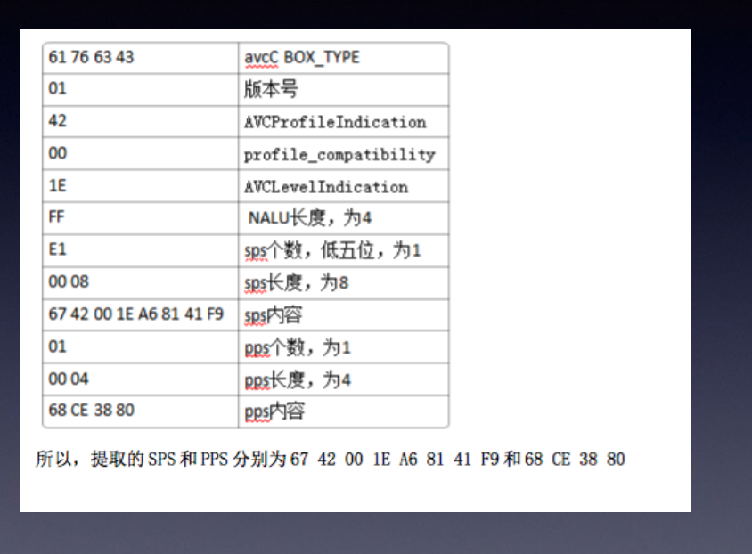
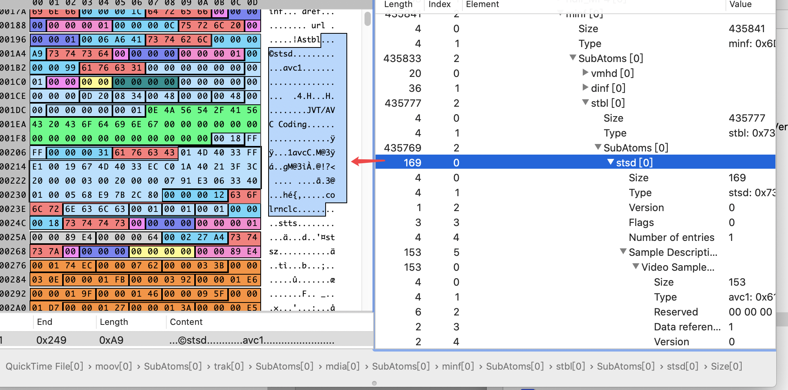

- Video25: 对应视频:`025. 13 QuickTime mp4容器分析_recv.ev4`
- Video26: 对应视频:`026. 14 AAC 音频格式_recv.ev4`
- Video27: 对应视频:`027.15 AAC实时转换 1_recv.ev4`
- Video28: 对应视频:`028. 16 AAC实时转换 2_recv.ev4`

# Video25

## 1.  MP4格式(H. 264+AAC)

1. MP4格式对应标准为ISO/IEC 14496-12(信息技术 视听对象编码的第12部分: IS0 基本媒体文件格式 /Information technology Coding of audio-visual objects Part 12: ISO base media file format) 附--标准免费下载: Freely Available

2. MP4封装格式是基于QuickTime容器格式定义，媒体描述与媒体数据分开，目前被广泛应用于封装h.264视频和ACC音频，是高清视频/HDV的代表。

3. MP4文件中所有数据都封装在`box`中(对应QuickTime中的`atom`),即MP4文件是由若干个box组成，每个box有`长度`和`类型`，每个box中还可以包含另外的`子bo`x (称`container box`) 。

4. MP4中box存储方式为`大端模式`。一般，标准的`box开头`会有四个字节的`box size`.

- 一个MP4 文件**首先**会`有且只有`**一个**“**ftyp**” 类型的**box**,作为MP4格式的标志并包含关于文件的一些信息;
- **之后**会`有且只有`一个“**moov**”`类型`的`box` (`Movie Box`),它是一种`container box`,`子box`包含了媒体的`metadata信息`;
- MP4文件的`媒体数据`包含在“**mdat**” `类型`的box (`Midia Data Box`) 中，该类型的box也是`container box`, `可以有多个`，`也可以没有`(当媒体数据全部引用其他文件时)，媒体数据的结构由`metadata` 进行描述。

---

- **track**: 表示一些`sample`的集合，对于媒体数据来说，`track`表示一个`视频`或`音频`**序列**。

- **hint track**: **特殊的**`track`, `并不包含`**媒体数据**，包含的是一些`将``其他数据track` **打包**成`流媒体`的`指示信息`。

- **sample**: 对于`非hint track`来说， `video sample`即为`一帧视频`，**或**`一组`**连续**`视频帧`， `audio sample`即为`一段`**连续**的`压缩音频`，它们**统称**`sample`.对于`hint track,` **sample**定义`一个`或`多个`**流媒体包**的格式。

- **sample table**:  指明`sample`**时序**和**物理布局**的表。

- **chunk** :一个**track**`的`几个**sample** **组成**的**单元**。

## mp4 Info 工具

