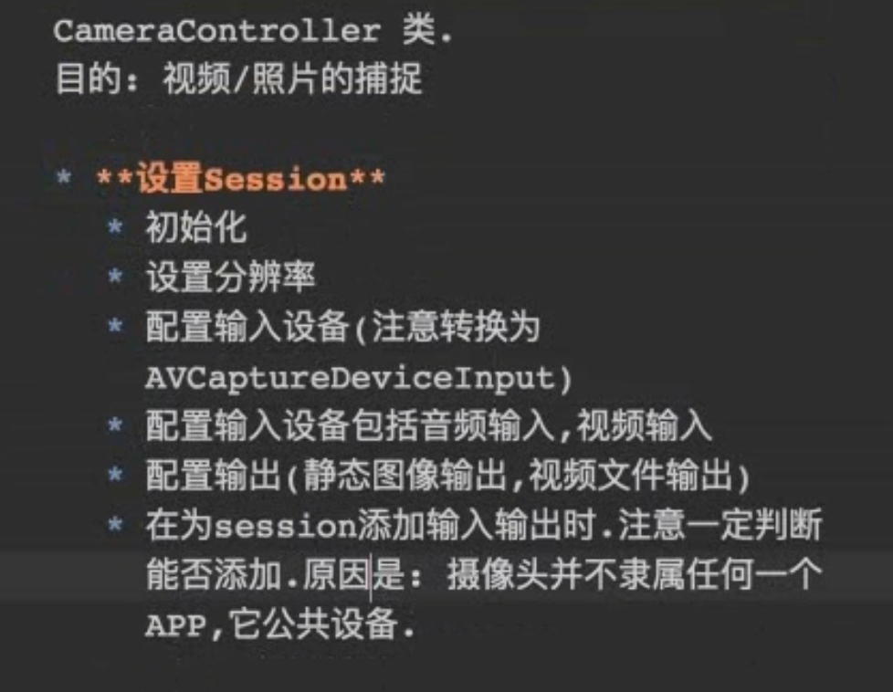

## 捕捉会话

- 捕捉会话: AVCaptureSession
- 捕捉设备: AVCaptureDevice 
- 捕捉设备输入:  AVCaptureDeviceInput
- 捕捉设备输出:  AVCaptureOutput
  - AVCaptureStillImageOutput (静态图片)
  - AVCaptureMovieFileOutput (视频输出)
  
- 捕捉连接类: AVCaptureConnection
  - 它建立输入和输出 的连接

- 捕捉预览(拍了些什么东西看看):   AVCaptureVideoPreviewLayer


## AVCaptureSession 插座板

1. 做**输入**和**输出**的连接工作


## 捕捉设备: 

摄像头, 麦克风, 这些都是捕捉设备

方法
- 光圈
- 聚焦
- 闪光灯

## 捕捉设备输入
有
- 音频输入
- 视频输入


## 捕捉设备输出:   ---抽象类

有可能输出声音
有可能输出视频


## 捕捉连接类: AVCaptureConnection
它建立输入和输出 的连接

拍摄视频的时候,用一个类来实时显示摄像头的拍摄到的内容, 


## captureDevicePointOfInterestForPoint 点击屏幕聚焦

你点击屏幕,说要聚焦到那个地方..

获取屏幕坐标系的CGPoint数据, 返回转换得到摄像头设备坐标系的CGPoint数据

## pointForCaptureDevicePointOfInterest
和上面的正好相反
获取摄像头坐标系的CGPoint数据, 返回转换得到的屏幕坐标系CGPoint数据


## 摄像头是一个公共设备, 它不隶属某一个APP,  有可能别的APP也在使用, 添加之前要看看能不能添加

```

if ([self.captureSession canAddInput:videoInput]) {

 [self.captureSession addInput:videoInput];

 self.activeVideoInput = videoInput;

 }

```





## AVCaptureDevice 的 isFocusPointOfInterestSupported

看看是否能支持聚焦

- iPhone6的前置摄像头是不支持聚焦的.
- iPhone6P 6s 一声 前置摄像头才支持聚焦