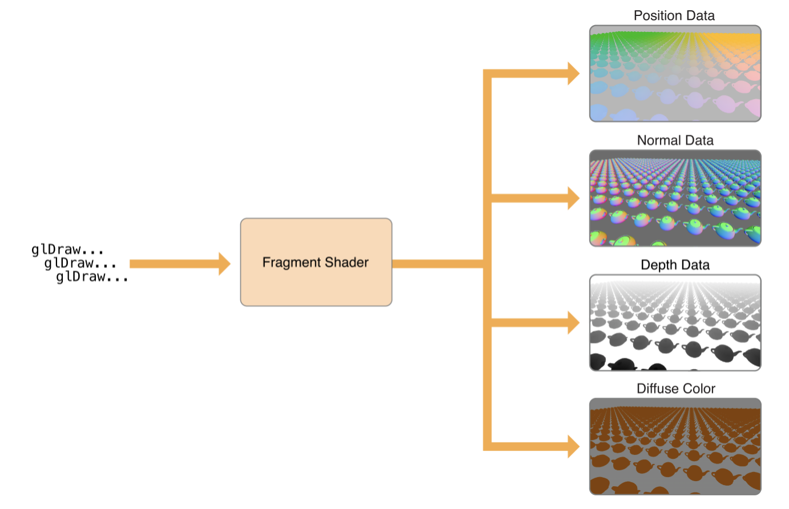

如果你想了解OpenGL ES版本和渲染算法的关系, 你看这个.

目前iOS支持三种OpenGL ES. 1.0,2.0,3.0


# OpenGL ES 3.0
OpenGL ES3.0 是iOS7才有的. 3.0 可以使用高级图形编程技术(advanced graphics programming techniques), 以前只能在桌面版上使用


OpenGL ES 3.0 is new in iOS 7\. Your app can use features introduced in OpenGL ES 3.0 to implement advanced graphics programming techniques—previously available only on desktop-class hardware and game consoles—for faster graphics performance and compelling visual effects.

Some key features of OpenGL ES 3.0 are highlighted below. For a complete overview, see the _OpenGL ES 3.0 Specification_ in the [OpenGL ES API Registry](http://www.khronos.org/registry/gles/).


# OpenGL ES Shading Language Version 3.0 (GLSL3.0)

GLSL3.0 增加了: uniform blocks, 32-bit integers, and additional integer operations, for performing more general-purpose computing tasks within vertex and fragment shader programs.

### 用GLSL3.0 , 在着色器文件里不必须要在最前面加#version 330 es
### ES3.0 上下文兼容2.0的着色器
[ES 3.0规范啥的](https://developer.apple.com/library/content/documentation/3DDrawing/Conceptual/OpenGLES_ProgrammingGuide/AdoptingOpenGLES3/AdoptingOpenGLES3.html#//apple_ref/doc/uid/TP40008793-CH504-SW18)

#  可以多个渲染目标

通过启用多个渲染目标,  你可以创建片元着色器, 同时写入多个帧缓冲区附件.
这个功能可以使用高级渲染算法. APP先渲染一组纹理以存储几何数据, 然后从那个组里面拿一个或多个纹理来渲染, 再执行一个光照最后输图片.



除了[创建帧缓冲区对象](https://developer.apple.com/library/content/documentation/3DDrawing/Conceptual/OpenGLES_ProgrammingGuide/WorkingwithEAGLContexts/WorkingwithEAGLContexts.html#//apple_ref/doc/uid/TP40008793-CH103-SW5)中描述的过程外，您还可以设置多个渲染目标。

```

//清单6-1   设置多个渲染目标
//将（之前创建的）纹理附加到帧缓冲区。
glFramebufferTexture2D（GL_DRAW_FRAMEBUFFER，GL_COLOR_ATTACHMENT0，GL_TEXTURE_2D，_colorTexture，0）;
glFramebufferTexture2D（GL_DRAW_FRAMEBUFFER，GL_COLOR_ATTACHMENT1，GL_TEXTURE_2D，_positionTexture，0）;
glFramebufferTexture2D（GL_DRAW_FRAMEBUFFER，GL_COLOR_ATTACHMENT2，GL_TEXTURE_2D，_normalTexture，0）;
glFramebufferTexture2D（GL_DRAW_FRAMEBUFFER，GL_DEPTH_STENCIL_ATTACHMENT，GL_TEXTURE_2D，_depthTexture，0）;
 
//指定用于渲染的帧缓冲附件。
GLenum targets [] = {GL_COLOR_ATTACHMENT0，GL_COLOR_ATTACHMENT1，GL_COLOR_ATTACHMENT2};
glDrawBuffers（3，targets）;

```


```

// listing 6-2  Fragment shader with output to multiple render targets
// #version 300 es
 
uniform lowp sampler2D myTexture;
in mediump vec2 texCoord;
in mediump vec4 position;
in mediump vec3 normal;
 
layout(location = 0) out lowp vec4 colorData;
layout(location = 1) out mediump vec4 positionData;
layout(location = 2) out mediump vec4 normalData;
 
void main()
{
    colorData = texture(myTexture, texCoord);
    positionData = position;
    normalData = vec4(normalize(normal), 1.0);
}

```
多个渲染目标对于其他高级图形技术也是有用的，例如real-time reflections，screen-space ambient occlusion, 和 volumetric lighting.

Multiple render targets can also be useful for other advanced graphics techniques, such as real-time reflections, screen-space ambient occlusion, and volumetric lighting.


# Transform Feedback

总之就是高效率使用硬件为我们做事,   这个功能可以将顶点着色器的输出捕捉到GPU内存的缓存对象中去, 
这个技术可以从一个渲染通道捕获数据以用于另一个渲染通道. 或者禁用部分graphics pipeline, 然后用Transform Feedback计算.

从Transform Feedback 这个技术收益的是粒子动画.
首先，应用程序设置粒子模拟的初始状态。然后，对于每个渲染帧，应用程序运行一个模拟步骤，更新每个模拟粒子的位置，方向和速度，然后绘制代表粒子当前状态的可视化资源。


以前实现粒子系统是在CPU上模拟, 将计算好的结果通过buffer给GPU, 但是顶点buffer给GPU非常耗时, 一帮科学家通过优化GPU硬件中可用的并行架构的功能, 就很好的解决这个问题-----Transform Feedback


使用Transform Feedback会更高效更屌!(With transform feedback, you can design your rendering engine to solve this problem more efficiently.)
通过变换反馈，您可以设计渲染引擎，从而更高效地解决此问题。图6-5显示了应用程序如何配置OpenGL ES图形管道来实现粒子系统动画。由于OpenGL ES将每个粒子及其状态表示为顶点，因此GPU的顶点着色器阶段可以同时运行多个粒子的模拟。因为包含粒子状态数据的顶点缓冲区在帧之间被重用，所以在初始化时，仅仅发生一次昂贵的将数据传送到GPU存储器的过程。


1.  在初始化时，创建一个顶点缓冲区，并在模拟中填充包含所有粒子初始状态的数据。

2.  在GLSL顶点着色器程序中实现您的粒子模拟，并通过绘制包含粒子位置数据的顶点缓冲区的内容来运行它的每一帧。

    *   要启用变换反馈，请调用该`glBeginTransformFeedback`函数。（`glEndTransformFeedback()`在恢复正常绘图之前调用。）

    *   使用`glTransformFeedbackVaryings`函数来指定哪些着色器输出应由变换反馈来捕捉，并使用`glBindBufferBase`或`glBindBufferRange`功能和`GL_TRANSFORM_FEEDBACK_BUFFER`缓冲类型，指定它们将被捕获到缓冲器中。

    *   通过调用禁用栅格化（以及管道的后续阶段）`glEnable(GL_RASTERIZER_DISCARD)`。

3.  要渲染模拟结果进行显示，请使用包含粒子位置的顶点缓冲区作为第二个绘制阶段的输入，再次启用光栅化（以及管道的其余部分），并使用适合渲染应用视觉内容的顶点和片段着色器。

4.  在下一帧，使用上一帧模拟步骤输出的顶点缓冲区作为下一个模拟步骤的输入。

其他可以受益于变换反馈的图形编程技术包括骨骼动画（也称为蒙皮）和射线游行。
skeletal animation 和  ray marching 也可以用这个技术实现.


总结这个设计的重要特征：

*   在实际中创建静态资源。

*   内部渲染循环在修改动态资源和提交渲染命令之间交替。尽量避免修改动态资源，除了在帧的开始或结束。

*   避免将中间渲染结果读回您的应用程序。

本章其余部分将提供有用的OpenGL ES编程技术来实现此渲染循环的功能。后面的章节将演示如何将这些通用技术应用于OpenGL ES编程的特定领域。

*   [避免同步和刷新操作](https://developer.apple.com/library/content/documentation/3DDrawing/Conceptual/OpenGLES_ProgrammingGuide/OpenGLESApplicationDesign/OpenGLESApplicationDesign.html#//apple_ref/doc/uid/TP40008793-CH6-SW3)

*   [避免查询OpenGL ES状态](https://developer.apple.com/library/content/documentation/3DDrawing/Conceptual/OpenGLES_ProgrammingGuide/OpenGLESApplicationDesign/OpenGLESApplicationDesign.html#//apple_ref/doc/uid/TP40008793-CH6-SW16)

*   [使用OpenGL ES来管理您的资源](https://developer.apple.com/library/content/documentation/3DDrawing/Conceptual/OpenGLES_ProgrammingGuide/OpenGLESApplicationDesign/OpenGLESApplicationDesign.html#//apple_ref/doc/uid/TP40008793-CH6-SW4)

*   [使用双缓冲来避免资源冲突](https://developer.apple.com/library/content/documentation/3DDrawing/Conceptual/OpenGLES_ProgrammingGuide/OpenGLESApplicationDesign/OpenGLESApplicationDesign.html#//apple_ref/doc/uid/TP40008793-CH6-SW5)

*   [注意OpenGL ES状态](https://developer.apple.com/library/content/documentation/3DDrawing/Conceptual/OpenGLES_ProgrammingGuide/OpenGLESApplicationDesign/OpenGLESApplicationDesign.html#//apple_ref/doc/uid/TP40008793-CH6-SW6)

*   [用OpenGL ES对象封装状态](https://developer.apple.com/library/content/documentation/3DDrawing/Conceptual/OpenGLES_ProgrammingGuide/OpenGLESApplicationDesign/OpenGLESApplicationDesign.html#//apple_ref/doc/uid/TP40008793-CH6-SW7)


## 避免同步和刷新操作

OpenGL ES规范不要求实现立即执行命令。通常，命令排队到命令缓冲区，稍后由硬件执行。通常，OpenGL ES会一直等待，直到应用程序在将命令发送到硬件之前排队了许多命令为止 - 批处理通常更高效。但是，一些OpenGL ES函数必须立即刷新命令缓冲区。其他函数不仅可以刷新命令缓冲区，而且还可以阻止直到先前提交的命令已经完成，然后才能返回对应用程序的控 仅当需要此行为时才使用刷新和同步命令。过度使用刷新或同步命令可能会导致应用程序在等待硬件完成渲染时停止运行。

这些情况需要OpenGL ES将命令缓冲区提交给硬件执行。

*   该功能`glFlush`将命令缓冲区发送给图形硬件。它会阻塞，直到命令提交给硬件，但不会等待命令完成执行。

*   该函数`glFinish`刷新命令缓冲区，然后等待所有先前提交的命令在图形硬件上完成执行。

*   检索帧缓冲区内容的函数（如`glReadPixels`）也等待提交的命令完成。

*   命令缓冲区已满。
*   The function `glFlush` sends the command buffer to the graphics hardware. It blocks until commands are submitted to the hardware but does not wait for the commands to finish executing.

*   The function `glFinish` flushes the command buffer and then waits for all previously submitted commands to finish executing on the graphics hardware.

*   Functions that retrieve framebuffer content (such as `glReadPixels`) also wait for submitted commands to complete.

*   The command buffer is full.

#### glReadPixels函数可用于OpenGL截图啥的~


## Using glFlush Effectively(高效使用glFlush)
桌面的OpenGL, 周期性的用glFlush 函数来有效的平衡CPU和GPU的工作是满有效的, iOS不这样搞~
iOS图形硬件延迟渲染算法依赖缓存中顶点数据, 然后最佳解决本办法是hidden surface removal.
然后调用的函数时`glFlush` or `glFinish`

The Tile-Based Deferred Rendering algorithm implemented by iOS graphics hardware depends on buffering all vertex data in a scene at once, so it can be optimally processed for hidden surface removal. Typically, there are only two situations where an OpenGL ES app should call the `glFlush` or `glFinish` functions.

* APP进入后台以后我们应该执行一下glFlush

*   You should flush the command buffer when your app moves to the background, because executing OpenGL ES commands on the GPU while your app is in the background causes iOS to terminate your app. (See [Implementing a Multitasking-Aware OpenGL ES App](https://developer.apple.com/library/content/documentation/3DDrawing/Conceptual/OpenGLES_ProgrammingGuide/ImplementingaMultitasking-awareOpenGLESApplication/ImplementingaMultitasking-awareOpenGLESApplication.html#//apple_ref/doc/uid/TP40008793-CH5-SW5).)

*   If your app shares OpenGL ES objects (such as vertex buffers or textures) between multiple contexts, you should call the `glFlush` function to synchronize access to these resources. For example, you should call the `glFlush` function after loading vertex data in one context to ensure that its contents are ready to be retrieved by another context. This advice also applies when sharing OpenGL ES objects with other iOS APIs such as Core Image.

