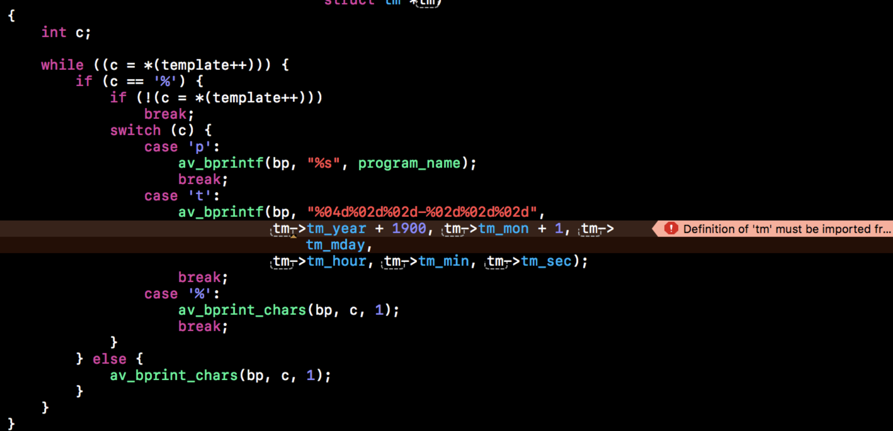
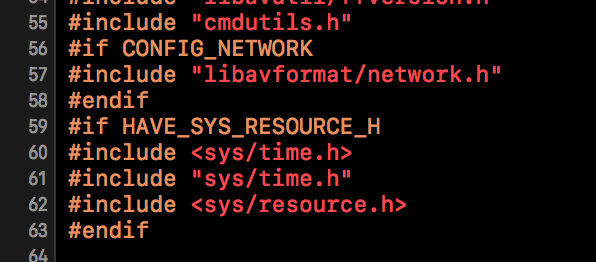
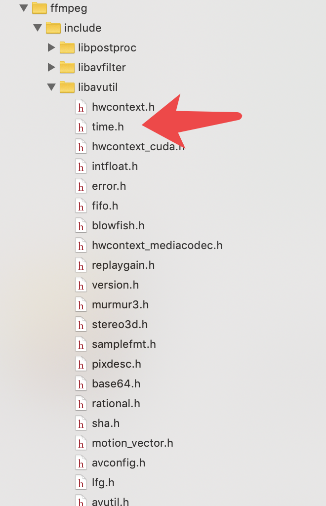
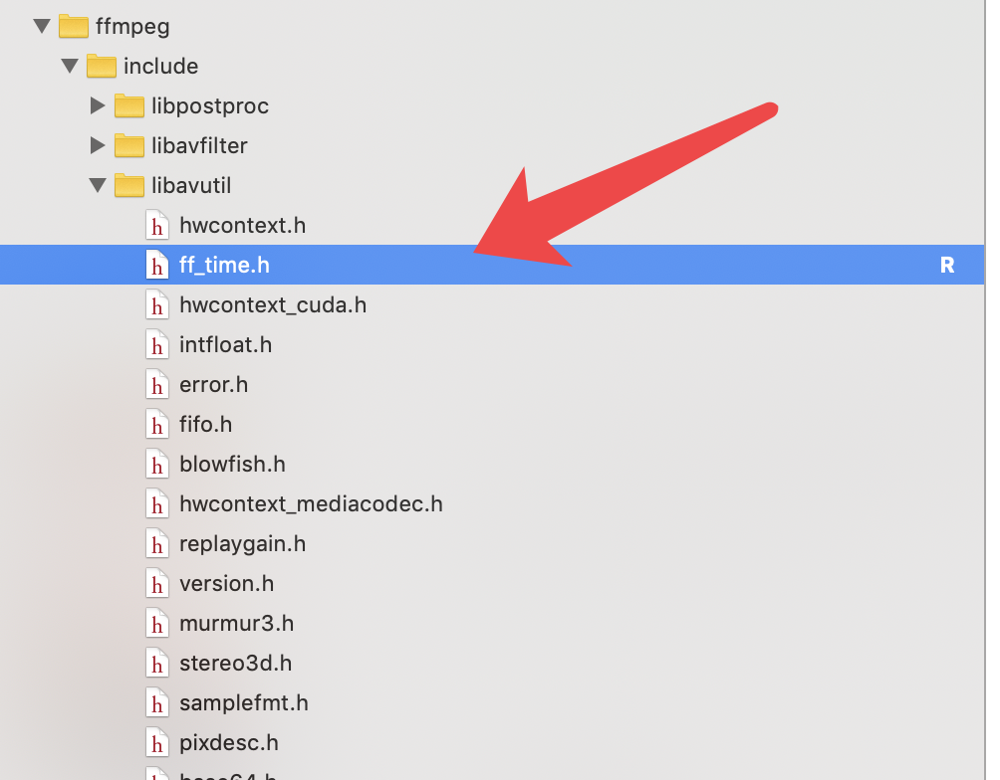
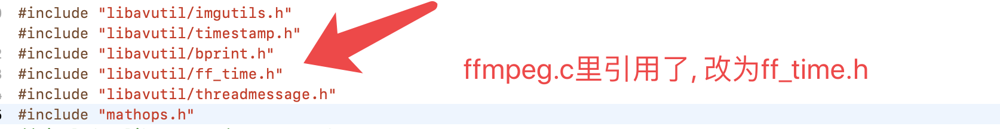

# Missing '#include <time.h>'; definition of 'tm' must be imported from module 'Darwin.C.time' before it is required 

使用FFmpeg的时候有一天莫名其妙的出现这个错误,  我是用FFmpeg做视频处理, 然后用的FFmpeg命令的方式, 然后用到了`cmdutils`, 之前一直用的好好的, 突然一天就出现了上面这个错误.


错误位置
```c

static void expand_filename_template(AVBPrint *bp, const char *template,
                                     struct tm *tm)
{
    int c;

    while ((c = *(template++))) {
        if (c == '%') {
            if (!(c = *(template++)))
                break;
            switch (c) {
            case 'p':
                av_bprintf(bp, "%s", program_name);
                break;
            case 't':
                av_bprintf(bp, "%04d%02d%02d-%02d%02d%02d",
                           tm->tm_year + 1900, tm->tm_mon + 1, tm->tm_mday,
                           tm->tm_hour, tm->tm_min, tm->tm_sec);
                break;
            case '%':
                av_bprint_chars(bp, c, 1);
                break;
            }
        } else {
            av_bprint_chars(bp, c, 1);
        }
    }
}
```




# cmdutils 文件包含了time.h

明明包含了却出现了错误, 



# 错误解决


### cmdutils 文件包含的系统的`#include <sys/time.h>`,  看下图
**FFmpeg 自身有个time.h**, 与系统的冲突了, 我们将FFmpeg的`time.h`, 改为 `ff_time.h`就行了



### 改`ff_time.h`



