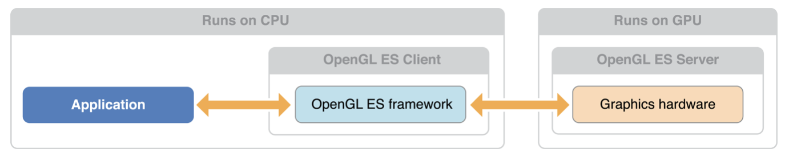
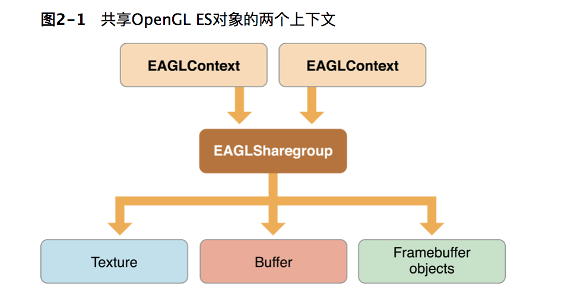

# OpenGL ES 是一个和平台无关的API

OpenGL ES 是基于C的API, 基于C的API就可以跨平台, 然后可以和Objective-C Cocoa Touch apps无缝衔接, opengl没有定义窗口层. 宿主操作系统必须提供创建一个用于接受命令的OpenGL ES上下文, 和一个用于写入绘图的缓冲区.


#  绝对不能同时从两个不同的线程访问相同的上下文


# 如何学习iOS OpenGL ES

技术一般的人, 先看[构建用于iOS的OpenGL ES应用程序清单](https://developer.apple.com/library/content/documentation/3DDrawing/Conceptual/OpenGLES_ProgrammingGuide/OpenGLESontheiPhone/OpenGLESontheiPhone.html#//apple_ref/doc/uid/TP40008793-CH101-SW1)，[配置OpenGL ES上下文](https://developer.apple.com/library/content/documentation/3DDrawing/Conceptual/OpenGLES_ProgrammingGuide/WorkingwithOpenGLESContexts/WorkingwithOpenGLESContexts.html#//apple_ref/doc/uid/TP40008793-CH2-SW1)，[使用OpenGL ES和GLKit进行绘制](https://developer.apple.com/library/content/documentation/3DDrawing/Conceptual/OpenGLES_ProgrammingGuide/DrawingWithOpenGLES/DrawingWithOpenGLES.html#//apple_ref/doc/uid/TP40008793-CH503-SW1)。这些章节概述了OpenGL ES如何与iOS集成，以及在iOS设备上启动并运行第一个OpenGL ES应用程序所需的所有详细信息。

原文:
 [Checklist for Building OpenGL ES Apps for iOS](https://developer.apple.com/library/content/documentation/3DDrawing/Conceptual/OpenGLES_ProgrammingGuide/OpenGLESontheiPhone/OpenGLESontheiPhone.html#//apple_ref/doc/uid/TP40008793-CH101-SW1), [Configuring OpenGL ES Contexts](https://developer.apple.com/library/content/documentation/3DDrawing/Conceptual/OpenGLES_ProgrammingGuide/WorkingwithOpenGLESContexts/WorkingwithOpenGLESContexts.html#//apple_ref/doc/uid/TP40008793-CH2-SW1), [Drawing with OpenGL ES and GLKit](https://developer.apple.com/library/content/documentation/3DDrawing/Conceptual/OpenGLES_ProgrammingGuide/DrawingWithOpenGLES/DrawingWithOpenGLES.html#//apple_ref/doc/uid/TP40008793-CH503-SW1). These chapters provide an overview of how OpenGL ES integrates into iOS and all the details necessary to get your first OpenGL ES apps up and running on an iOS device.


------------------------------------------------------------------------------------------------------------------------

如果您熟悉在iOS中使用OpenGL ES的基础知识，请阅读“ [绘制到其他渲染目标”](https://developer.apple.com/library/content/documentation/3DDrawing/Conceptual/OpenGLES_ProgrammingGuide/WorkingwithEAGLContexts/WorkingwithEAGLContexts.html#//apple_ref/doc/uid/TP40008793-CH103-SW1)和“ [多任务，高分辨率和其他iOS功能”](https://developer.apple.com/library/content/documentation/3DDrawing/Conceptual/OpenGLES_ProgrammingGuide/ImplementingaMultitasking-awareOpenGLESApplication/ImplementingaMultitasking-awareOpenGLESApplication.html#//apple_ref/doc/uid/TP40008793-CH5-SW1)以了解重要的特定于平台的准则。熟悉在5.0之前的iOS版本中使用OpenGL ES的开发人员应该学习[OpenGL ES和GLKit的绘图，以](https://developer.apple.com/library/content/documentation/3DDrawing/Conceptual/OpenGLES_ProgrammingGuide/DrawingWithOpenGLES/DrawingWithOpenGLES.html#//apple_ref/doc/uid/TP40008793-CH503-SW1)获得有关简化OpenGL ES开发的新功能的详细信息。

最后，阅读[OpenGL ES设计指南](https://developer.apple.com/library/content/documentation/3DDrawing/Conceptual/OpenGLES_ProgrammingGuide/OpenGLESApplicationDesign/OpenGLESApplicationDesign.html#//apple_ref/doc/uid/TP40008793-CH6-SW1)，[调整您的OpenGL ES应用程序](https://developer.apple.com/library/content/documentation/3DDrawing/Conceptual/OpenGLES_ProgrammingGuide/Performance/Performance.html#//apple_ref/doc/uid/TP40008793-CH105-SW1)，以及以下章节深入探讨如何设计高效的OpenGL ES应用程序。


原文
If you’re familiar with the basics of using OpenGL ES in iOS, read [Drawing to Other Rendering Destinations](https://developer.apple.com/library/content/documentation/3DDrawing/Conceptual/OpenGLES_ProgrammingGuide/WorkingwithEAGLContexts/WorkingwithEAGLContexts.html#//apple_ref/doc/uid/TP40008793-CH103-SW1) and [Multitasking, High Resolution, and Other iOS Features](https://developer.apple.com/library/content/documentation/3DDrawing/Conceptual/OpenGLES_ProgrammingGuide/ImplementingaMultitasking-awareOpenGLESApplication/ImplementingaMultitasking-awareOpenGLESApplication.html#//apple_ref/doc/uid/TP40008793-CH5-SW1) for important platform-specific guidelines. Developers familiar with using OpenGL ES in iOS versions before 5.0 should study [Drawing with OpenGL ES and GLKit](https://developer.apple.com/library/content/documentation/3DDrawing/Conceptual/OpenGLES_ProgrammingGuide/DrawingWithOpenGLES/DrawingWithOpenGLES.html#//apple_ref/doc/uid/TP40008793-CH503-SW1) for details on new features for streamlining OpenGL ES development.

Finally, read [OpenGL ES Design Guidelines](https://developer.apple.com/library/content/documentation/3DDrawing/Conceptual/OpenGLES_ProgrammingGuide/OpenGLESApplicationDesign/OpenGLESApplicationDesign.html#//apple_ref/doc/uid/TP40008793-CH6-SW1), [Tuning Your OpenGL ES App](https://developer.apple.com/library/content/documentation/3DDrawing/Conceptual/OpenGLES_ProgrammingGuide/Performance/Performance.html#//apple_ref/doc/uid/TP40008793-CH105-SW1), and the following chapters to dig deeper into how to design efficient OpenGL ES apps.

Unless otherwise noted, OpenGL ES code examples in this book target OpenGL ES 3.0\. You may need to make changes to use these code examples with other OpenGL ES versions.


#  Checklist for Building OpenGL ES Apps for iOS
# 用于构建iOS的OpenGL ES应用程序的步骤

iOS provides only one type of framebuffer, the OpenGL ES framebuffer object, and the [GLKView](https://developer.apple.com/documentation/glkit/glkview) and [CAEAGLLayer](https://developer.apple.com/documentation/quartzcore/caeagllayer) classes implement rendering destinations.

iOS只提供一种类型的帧缓冲区，OpenGL ES帧缓冲区对象，
[GLKView ](https://developer.apple.com/documentation/glkit/glkview) [CAEAGLLayer](https://developer.apple.com/documentation/quartzcore/caeagllayer)类实现渲染目标。


有一些是OpenGL ES编程通用的, 有一些是iOS特有的.

1. 确定使用OpenGL ES的版本, 创建OpenGL ES上下文
2. 运行时检验设备是否支持您要使用的OpenGL ES功能
3. 选择渲染OpenGL ES内容的位置
4. 确保你的应用程序在iOS中正常运行
5. 实现你的渲染引擎
6. 使用Xcode 和 Instruments 调试你的OpenGL ES应用


# 选择OpenGL ES 版本
*   OpenGL ES 3.0是iOS 7中的新功能。它增加了许多新功能，可以实现更高性能，通用GPU计算技术以及以前只能在桌面级硬件和游戏控制台上实现的更复杂的视觉效果。

*   OpenGL ES 2.0是iOS设备的基准配置文件，具有基于可编程着色器的可配置图形管道。

*   OpenGL ES 1.1只提供了一个基本的固定功能图形管道，在iOS中主要用于向后兼容。


您应该定位支持与您的应用最相关的功能和设备的OpenGL ES的版本。要了解有关iOS设备的OpenGL ES功能的更多信息，请阅读_[iOS设备兼容性参考](https://developer.apple.com/library/content/documentation/DeviceInformation/Reference/iOSDeviceCompatibility/Introduction/Introduction.html#//apple_ref/doc/uid/TP40013599)_。

要为您打算支持的OpenGL ES版本创建上下文，请阅读[配置OpenGL ES上下文](https://developer.apple.com/library/content/documentation/3DDrawing/Conceptual/OpenGLES_ProgrammingGuide/WorkingwithOpenGLESContexts/WorkingwithOpenGLESContexts.html#//apple_ref/doc/uid/TP40008793-CH2-SW1)。要了解您选择的OpenGL ES版本与您可能在应用中使用的渲染算法的关系，请阅读[OpenGL ES版本和渲染器体系结构](https://developer.apple.com/library/content/documentation/3DDrawing/Conceptual/OpenGLES_ProgrammingGuide/OpenGLESApplicationDesign/OpenGLESApplicationDesign.html#//apple_ref/doc/uid/TP40008793-CH6-SW2)。


# 配置OpenGL ES 上下文

## 在您的应用程序可以调用任何OpenGL ES函数之前，它必须初始化一个[EAGLContext](https://developer.apple.com/documentation/opengles/eaglcontext)对象。


## 当前上下文是OpenGL ES函数调用的目标
## iOS应用中的每个线程都有一个当前上下文
iOS应用中的每个线程都有一个当前上下文, 当你调用一个OpenGL ES函数时, 这是通过调用改变状态的上下文。
Every thread in an iOS app has a current context; when you call an OpenGL ES function, this is the context whose state is changed by the call.

```

// 设置当前上下文
[EAGLContext  setCurrentContext:_context];

// 获取当前上下文
[EAGLContext currentContext];


```

## 如果我们的应用要在多个线程上切换的话,  调用setCurrentContext之前先调用glFlush,  glFlush确保了以前提交的命令及时传送到图形硬件.
**Note:** If your app actively switches between two or more contexts on the same thread, call the `glFlush` function before setting a new context as the current context. This ensures that previously submitted commands are delivered to the graphics hardware in a timely fashion

OpenGL ES EAGLContext 对与当前上下文对应的对象有强烈的引用。（如果使用手动引用计数，OpenGL ES将保留此对象。）当您调用 [setCurrentContext:](https://developer.apple.com/documentation/opengles/eaglcontext/1624882-setcurrent) 方法来更改当前上下文时，OpenGL ES不再引用前一个上下文。（如果您正在使用手动引用计数，则OpenGL ES会释放该EAGLContext对象。）为防止`EAGLContext`在不是当前上下文的情况下释放对象，应用程序必须对这些对象进行强引用（或保留）。

OpenGL ES holds a strong reference to the `EAGLContext` object corresponding to the current context. (If you are using manual reference counting, OpenGL ES retains this object.) When you call the [setCurrentContext:](https://developer.apple.com/documentation/opengles/eaglcontext/1624882-setcurrent) method to change the current context, OpenGL ES no longer references the previous context. (If you are using manual reference counting, OpenGL ES releases the `EAGLContext` object.) To prevent `EAGLContext` objects from being deallocated when not the current context, your app must keep strong references to (or retain) these objects.


## 每个上下文都针对特定版本的OpenGL ES
一个[EAGLContext](https://developer.apple.com/documentation/opengles/eaglcontext)对象只支持一个版本的OpenGL ES。
设备不支持请求的OpenGL ES版本，则该[initWithAPI:](https://developer.apple.com/documentation/opengles/eaglcontext/1624895-init)方法返回`nil`。


## EAGL Sharegroup为上下文管理OpenGL ES对象
###  上下文保存了OpenGL ES状态

尽管上下文保存了OpenGL ES状态，但它不直接管理OpenGL ES对象。取而代之，OpenGL ES对象是由[EAGLSharegroup](https://developer.apple.com/documentation/opengles/eaglsharegroup)对象创建和维护的。每个上下文都包含一个[EAGLSharegroup](https://developer.apple.com/documentation/opengles/eaglsharegroup)委托创建对象的对象。




# EAGLSharegroup 一般是从第一个上下文那拿到的\\

```


EAGLContext * firstContext = CreateBestEAGLContext（）;

EAGLContext * secondContext = [[EAGLContext alloc] initWithAPI：[firstContext API] sharegroup：[firstContext sharegroup]];


_context = [[EAGLContext  alloc] initWithAPI:kEAGLRenderingAPIOpenGLES2];
 [EAGLContext  setCurrentContext:_context];
 [[EAGLContext  alloc] initWithAPI:kEAGLRenderingAPIOpenGLES2  sharegroup:_context.sharegroup];

```

当共享组由多个上下文共享时，应用程序有责任管理对OpenGL ES对象的状态更改。这是规则：

*   如果对象未被修改，您的应用程序可能会同时访问跨多个上下文的对象。

*   当对象被发送到上下文的命令修改时，该对象不能在任何其他上下文中被读取或修改。

*   在对象被修改之后，所有上下文都必须重新绑定对象才能看到更改。如果上下文在绑定它之前引用它，则该对象的内容是不确定的。

以下是您的应用程序应该遵循的更新OpenGL ES对象的步骤：

1.  调用`glFlush`每个可能使用该对象的上下文。

2.  在想要修改对象的上下文中，调用一个或多个OpenGL ES函数来更改对象。

3.  调用`glFlush`接收状态修改命令的上下文。

4.  在其他任何情况下，重新绑定对象标识符。


