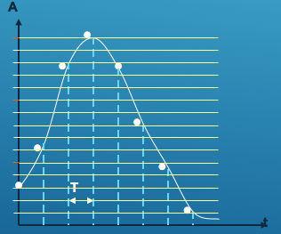
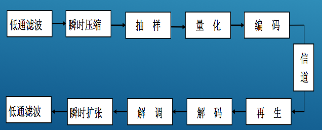
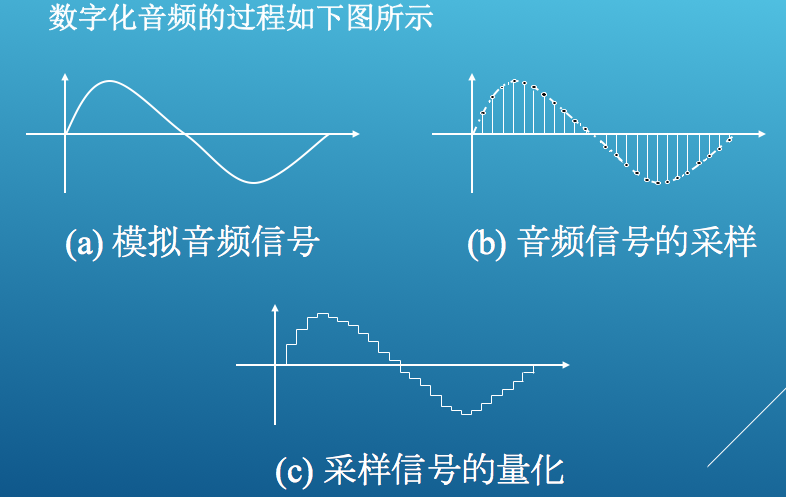
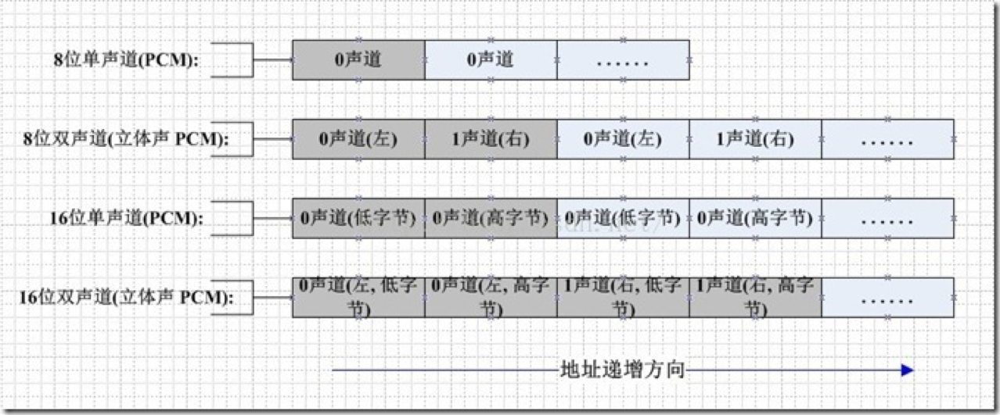

# 基本概念

## 数字音频信号


数字音频信号时将声波数字化后得到的, 能被计算机表示和处理

数字音频信号的技术指标
 1. 采样频率 (时间轴数字化)
 2. 量化位数 (幅度轴数字化)
 3. 声道数 




## 音频采集何处流程




## 术语解释一

44100HZ 16bit stereo 或者 22050HZ 8bit mono

44100HZ 16bit stereo
每秒44100 次采样, 采样数据用16位(2字节)记录, 双声道(立体声);

22050HZ 8bit mono
每秒 22050次采样, 采样数据用8位(1字节)记录, 单声道


## 采样精度
每个采样数据记录的是振幅,  ***采样精度***取决于存储空间的大小

1字节(也就是8bit) 只能记录256个数, 也就是只能讲振幅划分成256个等级.
2字节(也就是16bit) 可以细化到65535个数, ***CD***标准
4字节(也就是32bit) 能把振幅细分到4294967296个等级, -----太奢侈了

如果是双声道(stereo), 采样就是双份的, 文件也差不多大一份.


## 采样率
采样率是指: 
声音信号在 "模----->数" 转换过程中单位时间内采样的次数.
采样值是指每一次采样周期内声音模拟信号的积分值.

人对声音频率的识别范围是 20HZ - 20000HZ

其实每秒20000HZ完全满足人对声音的需求

但是我们常用的采样率是 22050

44100 是CD,   超过48000对人耳没意义

和电影的每秒24帧道理差不多


## PCM数据格式


```

# 数字传输系统
***数字传输系统 主要是讲,广域网之间的数据传输***


脉码调制PCM 体制最初是为了在电话局之间的中继线上传送多路的电话。
由于历史上的原因，PCM有两个互不兼容的国际标准,即北美的24 路
PCM (简称为T1) 和欧洲的30 路PCM (简称为E1)。我国采用的
是欧洲的E1标准。
而T1的速率是1.544 Mb/ s。
E1的速率是2.048 Mb/ s,
当需要有更高的数据率时，可采用复用的方法。

数字通信技术怎么实现数据传输


E1是时分复用


北美T1


```


PCM(Pulse Code Modulation)也被称为 脉码编码调制。

   PCM中的声音数据没有被压缩，如果是单声道的文件，采样数据按时间的先后顺序依次存入。

    一般情况下，一帧 PCM 是由 2048 次采样组成的。
     如果是双声道的文件，采样数据按时间先后顺序交叉地存入。如图所示:




 


