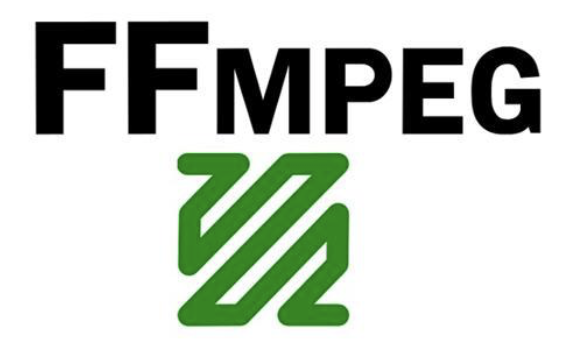

我尝试着用<<音视频 开发进阶指南>>上面的编译代码但是没有成功. 但是学到了相关知识.....

目标iOS能用的: ffmpeg + x264 + fdkaac





# 什么是iOS能用?

iOS能用是说iOS的基本设备能用.

基本设备就是还没被完全淘汰的设备, iPhone4-最新, 他们的都是arm架构, 但是具体又是不同的,各个设备如下:

armv6: iPhone, iPhone2, iPhone3G (已经被淘汰, iOS开发根本不用)
armv7: iPhone4, iPhone4s
armv7s: iPhone5, iPhone5s
arm64: iPhone5s, iPhone6(p), iPhone6s(p), iPhone7, iPhone8....
 
然后说iOS能用就是`armv7`, `armv7s`, `arm64`这些架构能用. 


# 大概思路是什么?


编译能用的`x264`, `fdkaac`, `ffmpeg`, 然后把他们三个合起来.

# 编译iOS能用的x264

- 下载源码: 
```

git clone http://git.videolan.org/git/x264.git

```


- 下载编译脚本

```

git clone https://github.com/kewlbear/x264-ios.git


```

- 将编译脚本build-x264放到x264源码文件夹同级目录下去


- 编译

```

./build-x264.sh

```

- 结果


- 验证


如图, 的确编译了三个版本的静态库


# 编译iOS能用的fdkaac


- 下载代码:
[fdk-aac-0.1.4.tar.gz](https://sourceforge.net/projects/opencore-amr/files/fdk-aac/fdk-aac-0.1.4.tar.gz/download "Click to download fdk-aac-0.1.4.tar.gz")


- 下载编译脚本
```

git clone https://github.com/kewlbear/fdk-aac-build-script-for-iOS.git

```

- 将fdkaac源码拖到编译脚本文件夹下去


- 修改脚本`build-fdk-aac.sh`,的ARCHS,SOURCE为如下

```

ARCHS="arm64 armv7 armv7s"

SOURCE="fdk-aac-0.1.4"

```


- 结果和验证


# 编译iOS能用的ffmpeg


- 下载源码

```

http://www.ffmpeg.org/releases/ffmpeg-3.4.2.tar.gz

tar xf ffmpeg-3.4.2.tar.gz


```

- 下载`gas-preprocessor.pl`

```

git clone  https://github.com/libav/gas-preprocessor

```
将`gas-preprocessor.pl`copy到`/usr/local/bin`
给`gas-preprocessor.pl`添加可执行功能`chmod 777 gas-preprocessor.pl`


- 下载安装汇编工具yasm, yasm版本必须大于等于1.2.0的

```

wget http://www.tortall.net/projects/yasm/releases/yasm-1.3.0.tar.gz

tar xf yasm-1.3.0.tar.gz

cd yasm-1.3.0

./configure

make

make install


```


- 下载编译脚本

```

git clone https://github.com/kewlbear/FFmpeg-iOS-build-script.git


```
- 将编译脚本build-ffmpeg.sh复制到,`ffmpeg-3.4.2`文件夹下


修改脚本如图


- 将编译好的fdkaac和x264静态库文件复制到`ffmpeg-3.4.2`文件夹下

x264


fdkaac


改名解释


进入ffmpeg源码文件

```


cd ffmpeg-3.4.2

./build-ffmpeg.sh

```

# ffmpeg 结果与验证


# iOS使用

- 新建一个文件夹ffmpegtools, 将编译好的`FFmpeg-iOS`(改名为ffmpeg), 和之前编译好的拖到ffmpeg里的`fdkaac`, `x264`, 复制到ffmpegtools文件夹下去


- 然后将`ffmpegtools`拖到xcode工程里去


- 添加依赖库

`AudioToolbox`, `VideoToolbox`, `libiconv`, `libbz2`, `libz`,`AVFoundation`


- Build Setting 设置


Build Setting ---->  搜索Header Search Paths
$(PROJECT_DIR)/ffmpegtest3/ffmpegtools/ffmpeg/include


