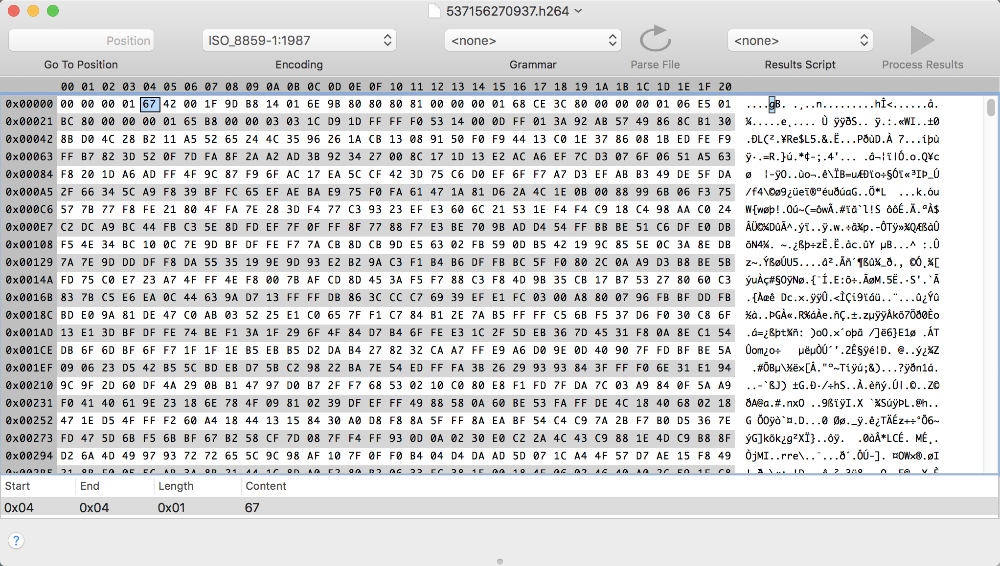
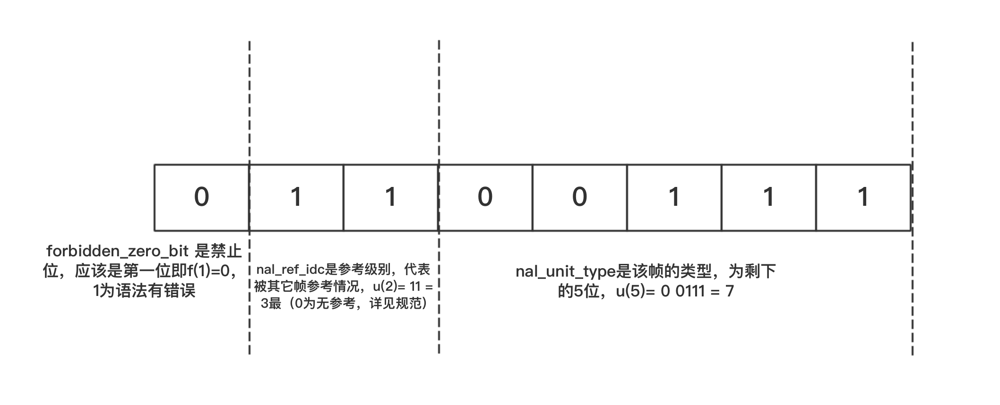
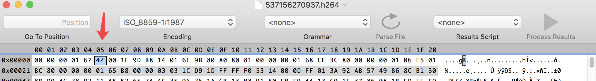
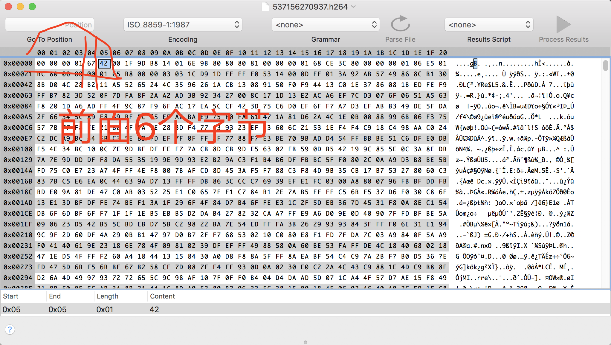

# 链接

[对H264码流数据的NAL起始字节分析（档次、NALU类型) ](http://blog.sina.com.cn/s/blog_6b87c7eb010182iv.html)


# 琐碎知识点




` 00 00 00 01 `   Start code

# forbidden_zero_bit   nal_ref_idc  nal_unit_type

Start code 后面的ox67(16进制) 转二进制为 0110 0111

```
00 00 00 01是Start code后面的ox67为 0110 0111

forbidden_zero_bit 是禁止位，应该是第一位即f(1)=0，1为语法有错误

nal_ref_idc是参考级别，代表被其它帧参考情况，u(2)= 11 = 3最（0为无参考，详见规范)

nal_unit_type是该帧的类型，为剩下的5位，u(5)= 0 0111 = 7

```



# NALU类型：
```

NALU类型：

目前类型有：

//H264定义的类型 values for nal_unit_type

typedef enum {

 NALU_TYPE_SLICE    = 1,

 NALU_TYPE_DPA      = 2,

 NALU_TYPE_DPB      = 3,

 NALU_TYPE_DPC      = 4,

 NALU_TYPE_IDR      = 5,

 NALU_TYPE_SEI      = 6,

 NALU_TYPE_SPS      = 7,

 NALU_TYPE_PPS      = 8,

 NALU_TYPE_AUD      = 9,

 NALU_TYPE_EOSEQ    = 10,

 NALU_TYPE_EOSTREAM = 11,

 NALU_TYPE_FILL     = 12,

#if (MVC_EXTENSION_ENABLE)

 NALU_TYPE_PREFIX   = 14,

 NALU_TYPE_SUB_SPS  = 15,

 NALU_TYPE_SLC_EXT  = 20,

 NALU_TYPE_VDRD     = 24  // View and Dependency Representation Delimiter NAL Unit

#endif

} NaluType;

可以看出是NALU_TYPE_SPS  即sequence parameter sets


```


# H264档次： 




profile_idc的u(8)则是后面的“42”转化为十进制则是66，

66 Baseline =======>: 1000010

77 Main        =======>: 1001101

88 Extended  =======>: 1011000

100 High (FRExt)   =======>: 1100100

110 High 10 (FRExt)  =======>: 1101110

122 High 4:2:2 (FRExt)   =======>: 1111010

144 High 4:4:4 (FRExt)   =======>: 10010000

100是High (FRExt)  =======>:





# 解码流程

# 参数集
# 序列参数集（SPS  Sequence parameter set）
# 图像参数集（PPS  Picture parameter set）

h.264解码中首先过滤码流获得参数集
