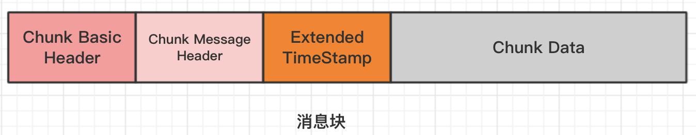
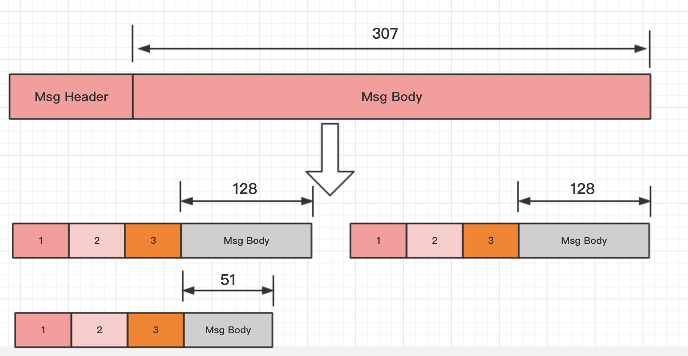

 [雷霄骅](https://blog.csdn.net/leixiaohua1020)

RTMP协议是一个互联网TCP/IP五层体系结构中应用层的协议。RTMP协议中`基本的数据单元`称为`消息`（`Message`）。当RTMP协议在互联网中传输数据的时候，消息会被`拆分`成更小的单元，称为`消息块`（`Chunk`）。

# 1 消息

消息是RTMP协议中`基本的数据单元`。不同种类的消息包含不同的`Message Type ID`，代表不同的功能。RTMP协议中一共规定了十多种消息类型，分别发挥着不同的作用。例如，Message Type ID在1-7的消息用于`协议控制`，这些消息一般是RTMP协议`自身管理`要使用的消息，用户一般情况下无需操作其中的数据。Message Type ID为`8，`9的消息分别用于传输`音频`和`视频`数据。Message Type ID为15-20的消息用于发送`AMF编码`的命令，负责用户与服务器之间的交互，比如`播放`，`暂停`等等。`消息首部`（`Message Header`）有四部分组成：`标志消息类型的Message Type ID`，`标志消息长度的Payload Length`，`标识时间戳的Timestamp`，`标识消息所属媒体流的Stream ID`。消息的报文结构如图所示。

# 2 消息快

在网络上传输数据时，消息需要被拆分成较小的数据块，才适合在相应的网络环境上传输。RTMP协议中规定，消息在网络上传输时被拆分成`消息块`（`Chunk`）。消息块首部（Chunk Header）有三部分组成：用于`标识本块的Chunk Basic Header`，用于`标识本块负载所属消息的Chunk Message Header`，以及当时间戳溢出时才出现的`Extended Timestamp`。消息块的报文结构如图所示。

# 3.消息分块

在消息被分割成几个消息块的过程中，`消息负载部分（Message Body）`被`分割`成大小固定的数据块（`默认是128字节`，最后一个数据块可以小于该固定长度），并在其首部加上消息块首部（Chunk Header），就组成了相应的消息块。消息分块过程如图5所示，一个大小为307字节的消息被分割成128字节的消息块（除了最后一个）。

RTMP传输媒体数据的过程中，发送端首先把媒体数据封装成消息，然后把消息分割成消息块，最后将分割后的消息块通过TCP协议发送出去。接收端在通过TCP协议收到数据后，首先把消息块重新组合成消息，然后通过对消息进行解封装处理就可以恢复出媒体数据。

