本文章为音视频基础知识, 会对音视频基本概念相关关键词进行讲解, 只有了解基本原理知识才能更好的做好音频开发.

啥也不说先看你图
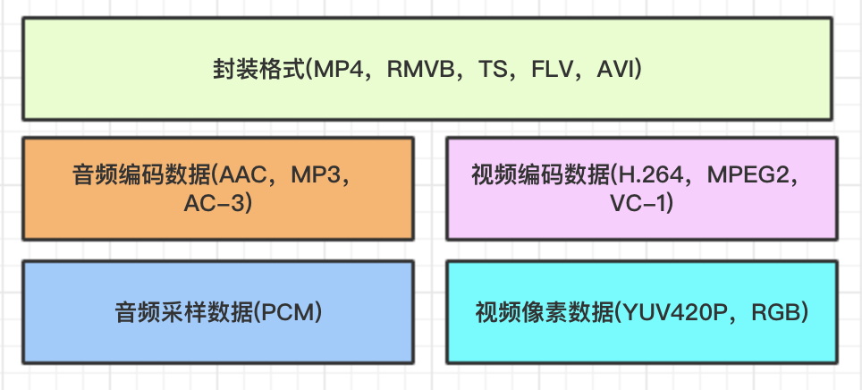
我们经常打交道的音视频`MP4，RMVB，TS，FLV，AVI`这些音视频领域叫做`封装格式`
`封装格式`是由`视频编码数据(H.264，MPEG2，VC-1) ` 和 `音频编码数据(AAC，MP3，AC-3)`组成, 括号里是种类.

`视频编码数据`是由`视频像素数据(YUV420P，RGB)`组成
`音频编码数据`是由`音频采样数据(PCM)`组成
本文是由下到上讲解的, `视频像素数据或者音频采样数据` -----> `音视频编码数据`------->并没有封装格式数据,因为不属于音视频基础


# 1.音频基础知识

## 1.1 声音的三要素

- 频率--音阶----xxxHz, xxxkHz
- 振幅--响度
- 波形--音色


- 人耳的听力频率范围, `20Hz~20kHz`
- 人耳对`3~4kHz`频率范围内的声音比较敏感


## 1.2 数字音频

- 首先关于数字音频,我想说的是我们是程序员, 我们研究音视频都是要将现实中这些物理数据`变成`(转换)成计算机中的`010101001`.
 - 就声音而言同一地点同一时间下会有很多声音(比如你在地铁中有地铁本身运行产生的声音,人说话的声音, 手机声音各种声音), 我们取其中一种声音出来研究,声音是振动产生的波, 波就有波形如下面那幅图中的`模拟信号`, 当然波形不一定那么规则. `模拟信号`可以理解为某一段时间段内某一个声音的所有数据.

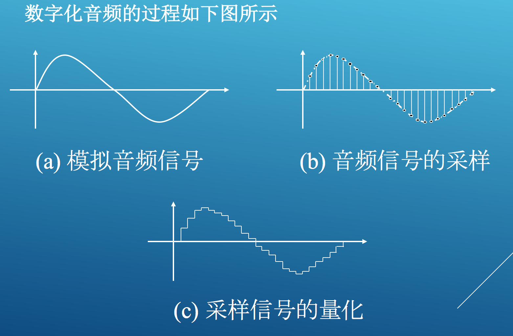

- 但是我们实际上我们只取其中一部分数据这就是`采样`, 取其中3个点,2个,5个?那取多少了这就是采样研究的问题. 根据人的听力频率范围是 `20Hz~20kHz`这么多,然后`奈奎斯特定理(采样定理)`: 按比声音最高频率高 2倍以上 的频率对声音进行采样, 所以一般的`采样率`就是44.1kHZ, 也就是1秒钟时间内平均采44100个点.

- 回到开始, 我们是做啥子的?撸代码的呗, 我得将数据数字化, 我们(实际上是机器, 这里我作为一个搞iOS开发的,就是苹果手机了.)采了那么多个点要放哪里?首先是存内存里后面你是丢到网上还是写文件那是后话, 存内存也还写文件也好`数据到我们程序员手里了`怎么表示了这些点, 一秒钟采了这么多个点一秒钟做一个数组好啦(或者两秒? 哎随意了), 那每个元素是什么东西是`int `吗?, 是`Float`吗?, 是`Double`?, 这就是`量化`要研究的.

- 一般呢`量化`不是说用哪个基础数据来表示, 关于量化说的是`用多少多少bit表示一个点`,对此又出现一个专有名词`sampleformat`中文叫`量化格式`或者`采样深度`或者`采样精度`, 反正都一回事, 面试说:"你们上家公司音频采样精度是多少啊"? 答: 16bit( 具体看你们是多少哈 )


三大概念: `采样`, `量化`, `编码`


- 1. 采样
```

采样就是对时间轴上的信号进行数字化

奈奎斯特定理(采样定理): 按比声音最高频率高 2倍以上 的频率对声音进行采样

人耳的听力频率范围, `20Hz~20kHz`, 所以采样评率一般为44.1kHz

44.1kHz意思是一秒钟采样44100次, 一秒钟才44100个点

```

- 2. 量化

```

上面的采样概念介绍了所一般我们用44.1kHz的频率采样, 意思是我们1秒钟要采样44100个点, 每个点怎么表示了? 这就是量化要做的事了.

量化是指在幅度轴上对信号进行数字化

用16比特的二进制信号来表示声音的一个采样点, 16比特(一个short)其范围是[-3268, 32767], 有65536个可能取值.

```

- 3. 编码 

```

每一个量化都是一个采样,那么多的采样该如何进行存储了?   这就涉及到编码的概念了.

所谓的编码就是按照一定的格式记录采样和量化后的数字数据, 比如顺序存储或压缩存储.


```


### 1.2.3 PCM

按照特定的`采样率`,特定的`采样精度`, 特定的`声道`采出来的数据就是PCM.


PCM ( Pulse Code Modulation )

PCM 就是音频的`裸数据`, 就是`脉冲编码调制数据`

描述一段PCM需要三个概念: `量化格式(sampleFormat)`(有的地方称: 采样精度, 采样深度),  `采样率(sampleRate)`, `声道数(channel)`


CD音质的PCM:  量化格式`16比特`(2字节),   采样率`44100`, 声道数`2`.
CD的比特率: 44100 * 16 * 2 = 1378.125 kbps
一分钟的CD音质数据大小.
1378.125 * 60 / 8 / 1024 = 10.09MB

### 1.2.4 描述
可能你会用到`Audacity`这款软件, 如图


然后你会看到	` 44100HZ 16bit stereo 或者 22050HZ 8bit mono 等等`
其中 `stereo表示双声道`, `mono表示单声道`


## 1.3 音频编码

裸数据太大了, 一分钟量化格式`16比特`(2字节),   采样率`44100`, 声道数`2`.的有10.09MB, 一般的歌基本上都是3-5分钟,那就差不多50多兆了, 太大了, 所以得对他进行压缩,.记住有哪几种编码算法就行. (记住`AAC`和 `mp3`)

- 压缩编码原理

```

压缩编码原理实际上是压缩掉冗余信号, 冗余信号是指不能被人耳感知的信号, 包含人耳听觉范围之外的音频信号以及被掩蔽掉的信号.

掩蔽 = 时域掩蔽 + 频域掩蔽


```

编码算法: `PCM`, `WAV`, `AAC`, `MP3`, `Ogg`

- 1. WAV = PCM + 44字节 (采样率, 声道数, 数据格式)
- 2. MP3

### 1.3.1 AAC

AAC有三种压缩技术规格`LC`, `HE`, `HE V2`, 不管哪种技术规格产生的格式只有两种 `ADIF`, `ADTS`, 规格就是AAC的版本一代二代三代, 格式就好比`单机游戏`和`网路游戏`. 先别问为什么啥的, 如果你是小白我希望你记或者背下来,这是基础知识没什么为什么.

#### AAC规格描述

- AAC LC : (Low Complexity)低复杂度, 码流128k

- AAC HE : AAC LC + `SBR (Spectral Band Replication)`, 码流64k
	-  SBR: 分频复用, 将音频的频带分成两部分, 低频和高频, 分别对他们进行编码, 对于低频的以前如果采样率是44.1k,就是每个正玄波采样2000次, 采样2000次就完整的记录下原来的模拟的声波,但是又太多了没必要,只需要记录主体就可以了, 就将采样率减少,   

  - 对于高频的, 20000Hz的, 以前如果我们是按照44.1k采样, 一个正玄周期只采了两个采样, 那么对于高频的保真性就很差, 而采用了`SBR`技术了,我们就增加高频的采样,保证高频的音质, 这样一是降低了码率第二又提高了音频的质量. 

- AAC HE V2 : AAC LC + SBR + `PS( Parametric, Stereo)` 码流32k
  - PS( Parametric, Stereo): 简单的说就是, 我们把双声道分别保存,  双声道一个声道的数据完整保存,另一个声道只存一些差异的东西, 之所以可以这么干是因为音频两个声道的声音的相关性非常强,


#### AAC格式

- ADIF (Audio Data Interchange Format)------`单机`
  - 这种格式只能从头开始解码, 常用在磁盘文件中
  - 说:我们有一个AAC的文件, 我们只要在这个文件的开头存一个很小的头, 里面包括采样率呀采样进度声道数啊这些基本能信息,  我们就可以对整个文件进行解读, 没拿出一帧的时候我们就套用头部的参数去解析他,这样就能播放出整个文件.


- ADTS (Audio Data Transport Stream)-------`网路`
  - 这种格式每一帧都有一个同步字, 可以在音频流的任何位置开始解码, 它适用于数据流格式. 
  - 说: ADTS就是在每一个音频帧的前面加一个同步字, 也就是加一个小的头7或9个字节. 这个家伙的好处就是, 流传输的话每收到一个音频帧就可以直接将它解出来, 
  - RTMP协议里, FLY格式文件里都有ADTS


#### AAC编码库哪个好?

你是安卓?iOS?嵌入式?不管怎样设备采集到的都是PCM, 我们要写成文件就要把PCM编码成AAC下面是一些库的比较.
音频的基础知识,关键词啥的基本就这些了.

Libfdk_AAC > ffmpeg AAC > libfaac > libvo_aacenc


# 视频基础知识

## 1.三原色和像素点
三原色: RGB, 红, 绿, 蓝

手机屏幕分辨是1280 x 720,  水平方向有720个像素点, 垂直方向1280个像素点. 整个手机屏幕就有1280 x 720个像素点

每个像素点都由三个子像素点组成

## 2. 像素点表示

- 浮点表示: 取值范围为0.0~1.0, 比如, 在OpenGL ES中对每一个`子像素点`的表示使用的就是这种表达方式

- 整数表示: 取值范围为0~255,或者00~FF, 8个比特表示一个子像素,32个比特表示一个像素.


一张1280*720的RGBA_8888的图片大小 1280*720*4 = 3.516MB


## 3. YUV

- Y表示明`亮度`(Luminance或Luma), 也称为灰阶值, 就是黑白,非黑及白

- "U" 和 "V"表示的则是`色度`( Chrominance 或者 Chroma )

```

它们的作用是描述影像的色彩及饱和度, 用于指定像素的颜色...

```

`亮度`是透过RGB输入信号来建立的, 方法是将RGB信号的特定部分叠加到一起. `色度`则定义了颜色的两个方面-----色调与饱和度,分别用`Cr`和`Cb`来表示.

Cr反映了RGB输入信号红色部分与RGB信号亮度值之间的差异, 而Cb反映的则是RGB输入信号蓝色部分与RGB信号亮度值之间的差异

### 最常用的表示形式是Y,U,V都是使用8bit表示, 所以取值范围就是0~255


### YUV 常见格式

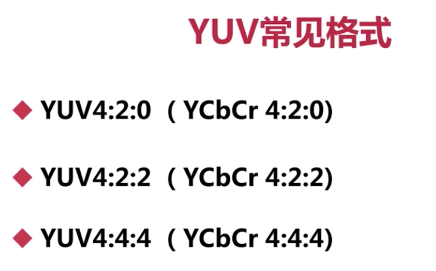

YUV 420 就是 4:1:1
YUV422 就是 2:1:1
YUV444 就是1:1:1

### YUV 存储格式


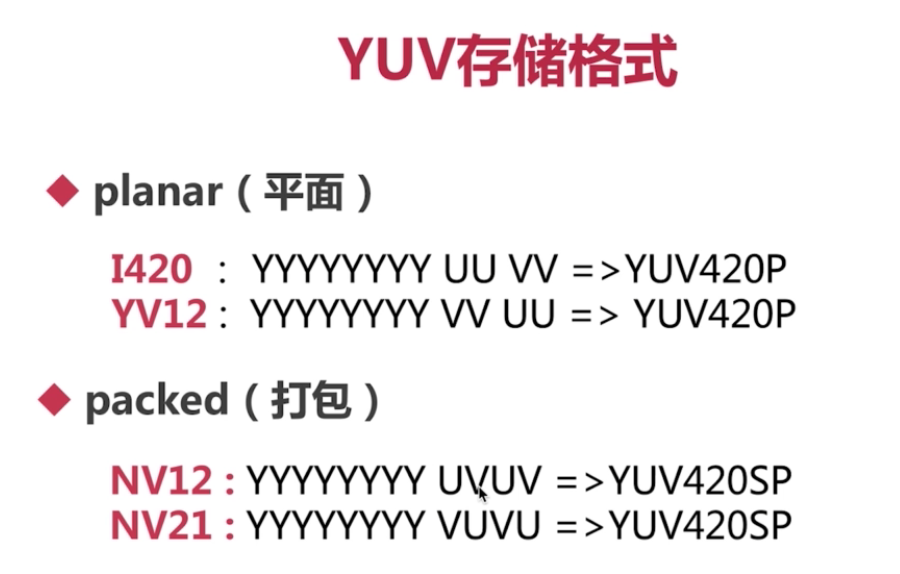


### 广播电视标准Rec.601 和 BT.709

在这两个标准中Y的取值范围16~235, UV的取值范围都是16~240

两个标准的RGB矩阵运算


```

// BT.601, which is the standard for SDTV.

static const GLfloat kColorConversion601[] = {

  1.164, 1.164, 1.164,

  0.0, -0.392, 2.017,

  1.596, -0.813, 0.0,

};

// BT.709, which is the standard for HDTV.

static const GLfloat kColorConversion709[] = {

  1.164, 1.164, 1.164,

  0.0, -0.213, 2.112,

  1.793, -0.533, 0.0,

};


```
书上说的是下面这个


## 编码概念

IPB帧

- I 帧: 帧内编码帧( intra picture ),  I帧通常是每一个GOP


- P帧: 前向预测帧 ( predictive-frame ),   参考前一帧

- B帧: 双向预测内插编码帧( bi-directional interpolated prediction frame ), 即考虑源图像序列前面的已编码帧, 又顾及源图像序列后面的已编码帧之间的时间冗余信息, 来压缩传输数据量的编码图像, 也称为双向预测帧.. `前后参考帧`


## DTS 与 PTS


- DTS 主要是用于视频的解码, 英文全称是Decoding Time Stamp

- PTS 主要是用于在解码阶段进行视频的同步和输出, 英文全称: Presentation Time Stamp


在没有B帧的情况下 DTS和PTS的输出顺序是一样的


## GOP

两个I帧之间形成的一组图片, 就是GOP ( Group of Picture )


## H.264

### SPS 和 PPS

`Sequence Parameter Set` , 序列参数集, 存放帧数, 参考帧数目, 解码图像尺寸, 帧场编码模式选择标识等

`Picture Parameter Set`, 图像参数集, 存放熵编码模式选择标识, 片组数目, 初始量化参数和去方块滤波数调整标识等

SVC技术: 分层传输(一帧数据, 小中大, 网络差发核心帧), 感觉上YouTube应该有用SVC技术

编码器
```

x264/x265
openH264
vp8/vp9

```

### 宏块划分与分组


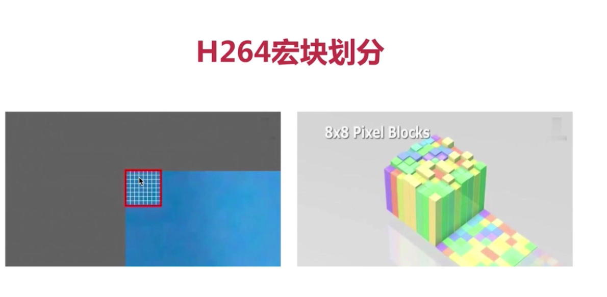
红色框起来的是一个宏块


字块分组
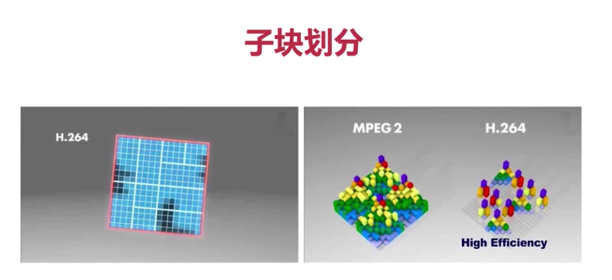

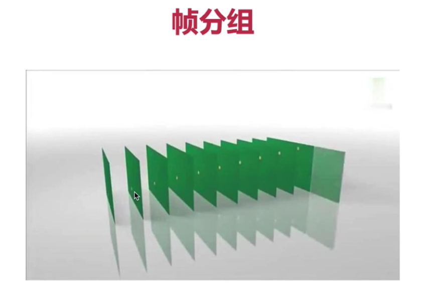


### H264结构和编码分层


- 编码分层

```

以太网每个包最大为1500字节..

NAL层(网路抽象层) Network Abstraction Layer. 
h264帧往往会超过1500字节, 所以就需要拆开发送, 拆包和后面的组包都需要NAL层


VCL层: Video Coding Layer 视频数据编码层


```

### 码流基本概念

- SODB
String Of Data Bits 原始数据比特流. 长度不一定是8的倍数, 它是由VCL层产生的
```

因为是流嘛, 所以就不一定是8的倍数?...计算机中就要是以8的整数倍去处理

```

- RBSP
Raw Byte Sequence Payload, `SODB ` + `trailing bits`, 算法是在SODB最后一位补1, 不按字节对齐则补0

```

RBSP就是SODB加上末尾位, 如果不是8位对齐的话就在后面补0

SODB是一个流, 流了就不知道它的结束在哪,为了知道它的结束在哪就在末尾补1,补了1之后没有8位对齐我们再补0对齐

```

- EBSP ( Encapsulate Byte Sequence Payload )
就是加起始位 ` 00 00 00 01 `16进制的4个字节

如果本身数据里面有` 00 00 00 01 `, 解决方法如下

如果遇到两个连续的0x00 就增加一个0x03
上面的这样的数据就称为EBSP

- NALU

```

NALU就是在 EBSP的基础上加一个字节的NAL Header

NAL Header (1B) + EBSP

```


### NAL Unit (NAL 单元)


NALU头部 加一个H264的切片
H264的切片又可以细分成`切片头`加`切片数据`

每一个h264帧由一个或多个切片组成
每一个切片有多个宏块组成
每一个宏块由多个子块组成

** 按切片来切 **
因为每一帧可能大于1500个字节, 我们就得拆开来传. 怎么拆, 就是把每一个切片组成一个包来传, `把每一个切片组成一个NAL单元来传`

### 宏块(MacroBlock)与切片 (Slice)

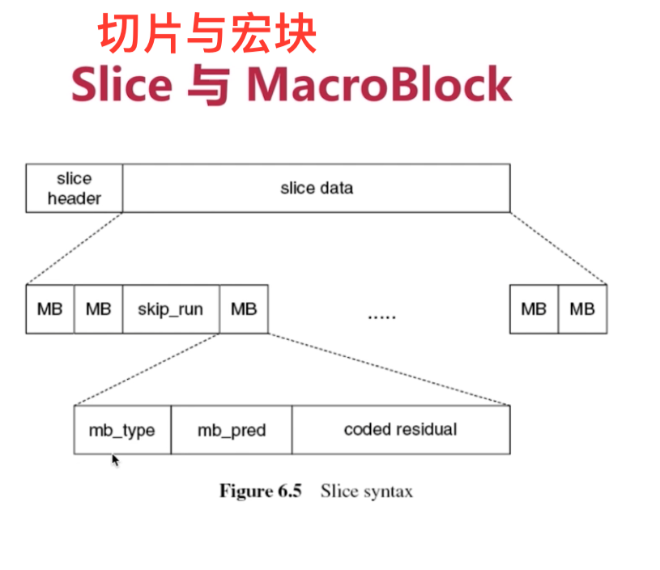

每一个切片都包含了切片头与切片数据

每个切片数据里又包含了很多宏块

每个宏块又包含了宏块的类型, 宏块的预测, 编码的残差数据


### H264切片

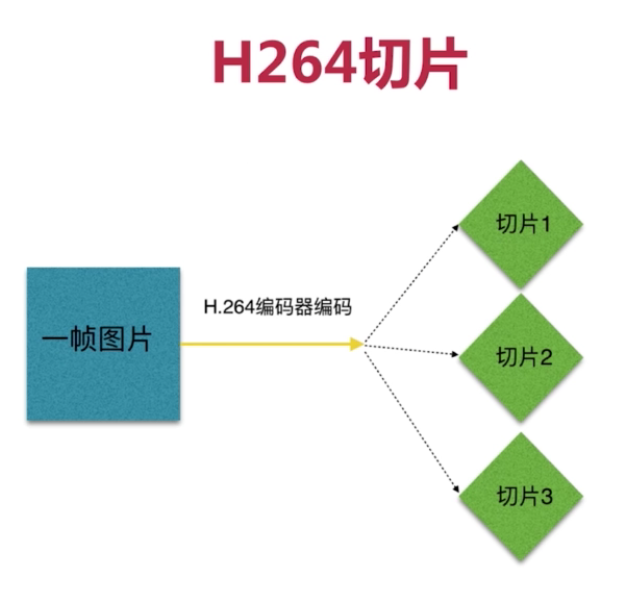


### H264压缩技术( 这块差不多知道有这么回事就ok了)

- 帧内预测压缩, 解决的是空域数据冗余问题
- 帧间预测压缩, 解决的是时域数据冗余问题
- 整数离散余弦变换( DCT), 将空间上的相关性变为频域上无关的数据然后进行量化
- CABAC 压缩( 无损压缩)


## NALU ( NAL 单元)


NALU = header( 一个字节 ) + body

### NAL Header

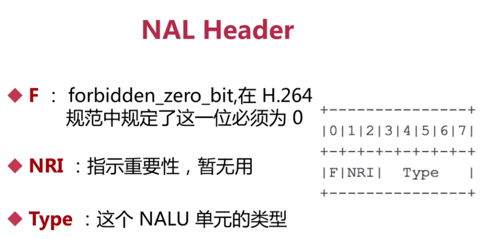

F: 必须是0
NRI: 没用

Type : 这个是NALU单元的类型 ** 重要 **


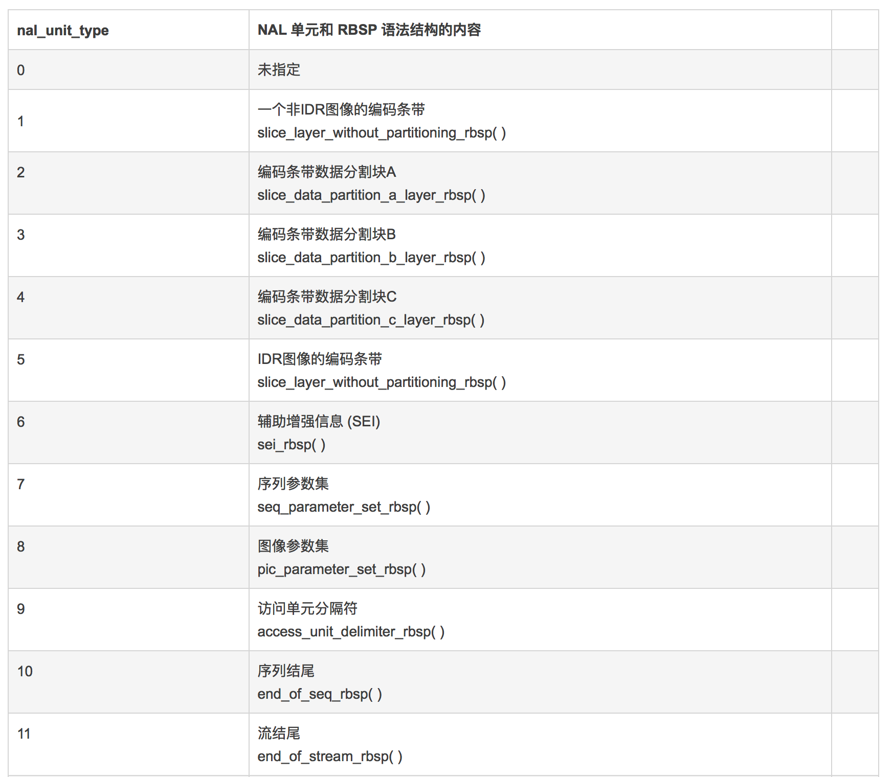
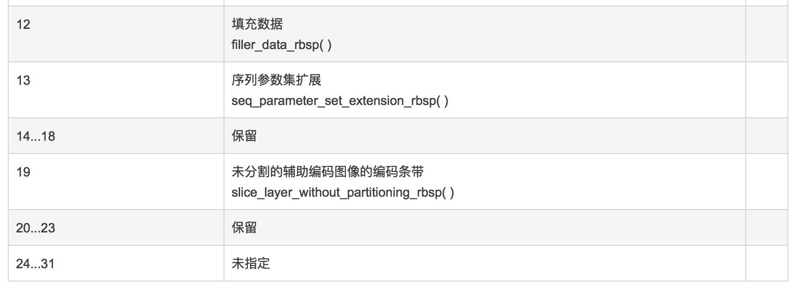
 

我们关注
- `5` -I帧
- `7`- 序列参数集 `SPS` 指导一个GOP的一些公共参数 一个序列里图片的宽高啥的,有多少帧
- `8`- 图像参数集 `PPS` 存放帧内的预测模式


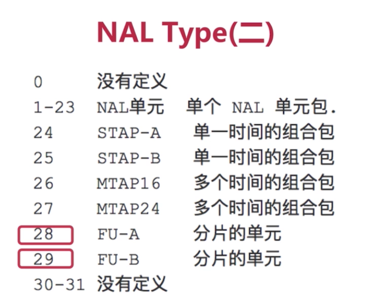

- `28` FU-A 分片的单元
- `29` FU-B 分片的单元

什么是`分片的单元`了? 我们的一个h264的一个帧通过网络传输, 而一个网络包了以太网最大是1500个字节, 存不下怎么办? 就要将它切成多个片, 每一个包就一个片, 最后进行组装


### NAL类型介绍

- `单一类型` 一个RTP包只包含一个?NALU,  一个h264帧里只包含一个切片.

- `组合类型` 一个RTP包里头包含多个NALU, 类型是24-27
```

在我一个NAL单元里, 在我一个RTP包里, 包括了多个NAL单元, 像SPS, PPS一般都在一个包里 (这两个单元数据都特别小就几个字节), 

```

- `分片类型` 一个NALU单元分成多个RTP包, 类型是28和29


####  单一NALU 的RTP包


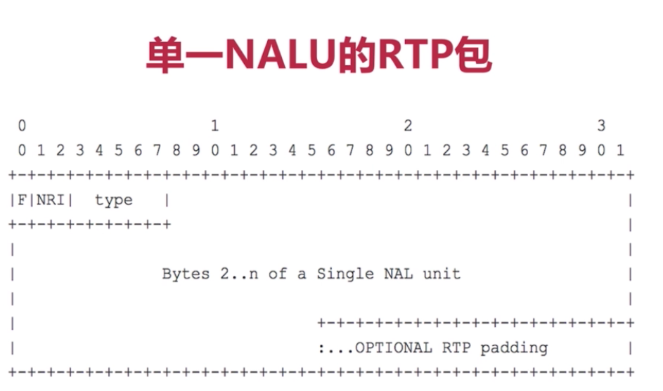

第一个字节就是header, type可以是5可以是1

#### 组合NALU的RTP包

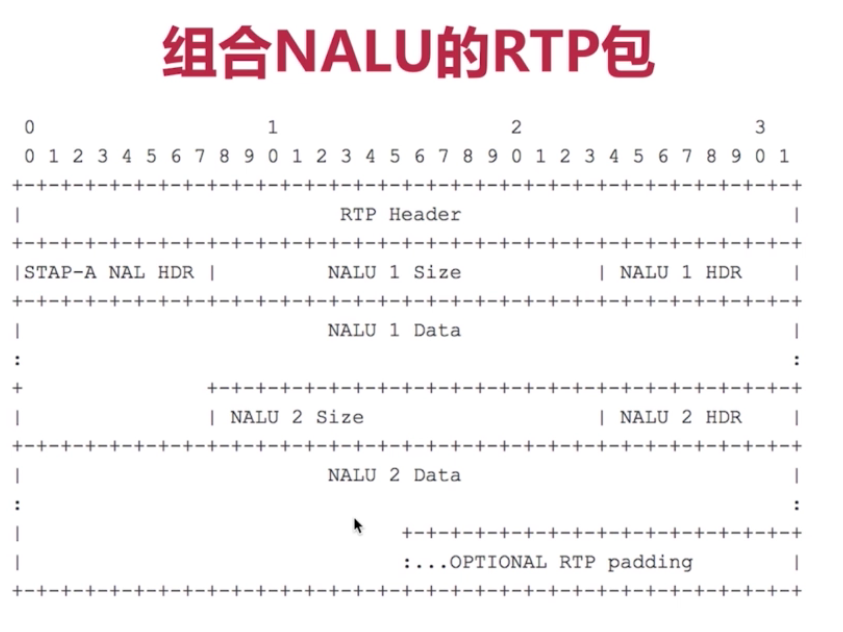


#### 分片NALU 的RTP包


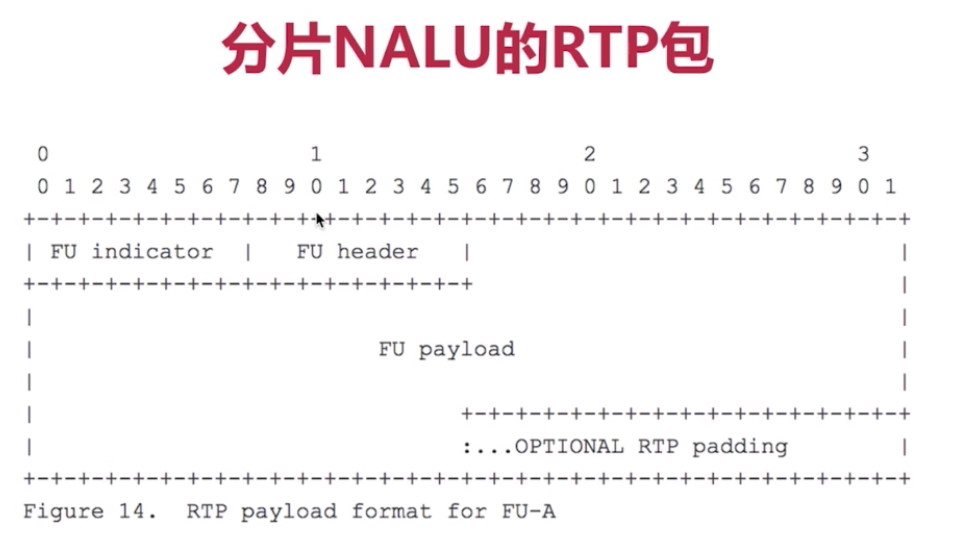


