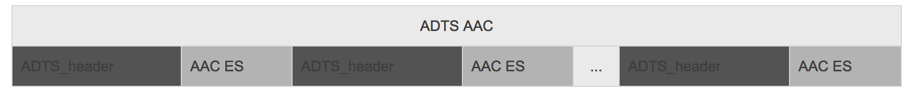
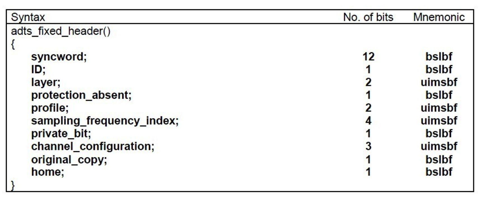
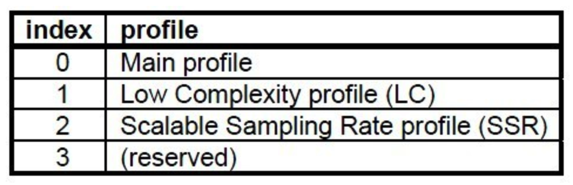
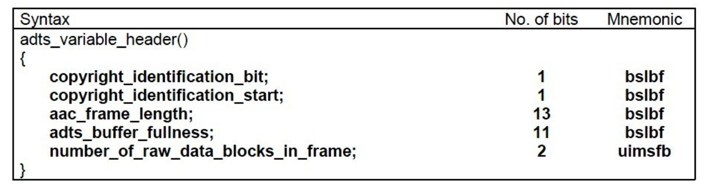

# ADTS

ADTS全称是(Audio Data Transport Stream), 是AAC的一种十分常见的传输格式, 是网络传输中的AAC.

ADTS AAC = AAC + ADTSHeader(7个字节)




# ADTS 内容及结构

ADTS 头里面有 `采样率`, `声道数`, ` 帧长度等`..
ADTS 分为两个部分: `adts_fixed_header();` 和 `adts_variable_header()`, 也就是固定头和可变头




**syncword **：同步头 总是0xFFF, all bits must be 1，代表着一个ADTS帧的开始
**ID**：MPEG Version: 0 for MPEG-4, 1 for MPEG-2
**Layer**：always: '00'
**profile**：表示使用哪个级别的AAC，有些芯片只支持AAC LC 。在MPEG-2 AAC中定义了3种：




**sampling_frequency_index**：表示使用的采样率下标，通过这个下标在 **Sampling Frequencies[ ]**数组中查找得知采样率的值。

There are 13 supported frequencies:

*   0: 96000 Hz
*   1: 88200 Hz
*   2: 64000 Hz
*   3: 48000 Hz
*   4: 44100 Hz
*   5: 32000 Hz
*   6: 24000 Hz
*   7: 22050 Hz
*   8: 16000 Hz
*   9: 12000 Hz
*   10: 11025 Hz
*   11: 8000 Hz
*   12: 7350 Hz
*   13: Reserved
*   14: Reserved
*   15: frequency is written explictly


**channel_configuration:** 表示声道数 

*   0: Defined in AOT Specifc Config
*   1: 1 channel: front-center
*   2: 2 channels: front-left, front-right
*   3: 3 channels: front-center, front-left, front-right
*   4: 4 channels: front-center, front-left, front-right, back-center
*   5: 5 channels: front-center, front-left, front-right, back-left, back-right
*   6: 6 channels: front-center, front-left, front-right, back-left, back-right, LFE-channel
*   7: 8 channels: front-center, front-left, front-right, side-left, side-right, back-left, back-right, LFE-channel
*   8-15: Reserved

```

typedef  struct {

 uint8_t headerSize;

 uint8_t ID;

 uint8_t profile;

 uint8_t samplingFrequencyIndex;

 uint8_t channelConfiguration;

} ADTSFixedHeader;

```




**frame_length** : 一个ADTS帧的长度包括ADTS头和AAC原始流.

**adts_buffer_fullness**：0x7FF 说明是码率可变的码流

```

typedef  struct {

 uint32_t frameLength;

 uint32_t adtsBufferFullness;

} ADTSVariableHeader;

```