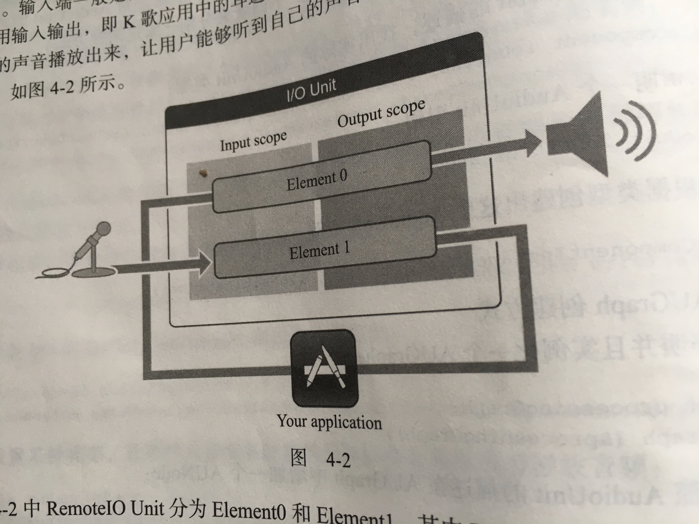
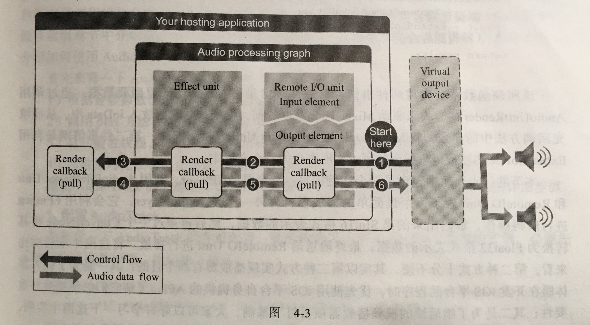

# 一. AudioUnit介绍与实践


## 1. 认识AudioSession

```

在iOS的音视频开发中, 使用具体API之前都会先创建一个会话, 这里也不例外.

AudioSession 用于管理与获取iOS设备音频的硬件信息, 并且是以单例的形式存在.

```

```

AVAudioSession * audioSession = [AVAudioSession  sharedInstance];

  // 1\. 根据我们需要硬件设备提供的能力来设置类别

 [audioSession setCategory:AVAudioSessionCategoryPlayAndRecord  error:nil];

  // 2\. 设置I/O的buffer 越小则说明延迟越低

 NSTimeInterval bufferDuration = 0.002;

 [audioSession setPreferredIOBufferDuration:bufferDuration error:nil];

  // 3\. 设置采样率, 让硬件设备按照设置的采样率来采集或者播放音频

 double hwSampleRate = 44100.0;

 [audioSession setPreferredSampleRate:hwSampleRate error:nil];

  // 4\. 当设置完毕所有的参数之后就可以激活AudioSession了

 [audioSession setActive:YES error:nil];

 _audioSession = audioSession;


```


## 2. 构建AudioUnit

```

在创建并启用音频会话之后,就可以构建AudioUnit了.
构建AudioUnit的时候需要指定 类型(Type), 子类型(subtype),  以及厂商(Manufacture). 

类型(Type)就是在下一小节提到的四大类型的AudioUnit的Type
子类型(subtype)就是该大类型下面的子类型(比如Effect该大类型下面有 EQ, Compressor, limiter等子类型)
厂商(Manufacture)一般情况比较固定, 直接写成kAudioUnitManufacturer_Apple

```
创建一个RemoteIO类型的AudioUnit的描述的结构体

```

//====

  AudioComponentDescription ioUnitDescription;

 ioUnitDescription.componentType = kAudioUnitType_Output;

 ioUnitDescription.componentSubType = kAudioUnitSubType_RemoteIO;

 ioUnitDescription.componentManufacturer = kAudioUnitManufacturer_Apple;

 ioUnitDescription.componentFlags = 0;

 ioUnitDescription.componentFlagsMask = 0;


```


如何使用描述来构造真正的AudioUnit呢?

- 第一个, 直接使用AudioUnit裸的创建方式
- 第二个, 使用AUGrah和AUNode来创建.(其实一个AUNode就是对AudioUnit的封装, 可以理解为一个AudioUnit的Wrapper)

- 裸创建
```

  // 1\. 首先根据AudioUnit的描述, 找出实际的AudioUnit类型

 AudioComponent ioUnitRef = AudioComponentFindNext(NULL, &ioUnitDescription);

  // 2\. 声明一个AudioUnit引用

 AudioUnit ioUnitInstance;

  // 3.最后根据类型创建出这个AudioUnit实例

 AudioComponentInstanceNew(ioUnitRef, &ioUnitInstance);

```

-  使用AUGrah和AUNode来创建

```

// 根据AUGraph方式创建

  //1\. 首先声明并且实例化一个AUGraph

 AUGraph processingGraph;

 NewAUGraph(&processingGraph);

  // 2.然后按照AudioUnit的描述在AUGraph中增加一个AUNode

 AUNode ioNode;

 AUGraphAddNode(processingGraph, &ioUnitDescription, &ioNode);

  // 3.接下来打开AUGraph, 其实打开AUGraph的过程也是间接实例化AUGraph中所有的AUNode.

  //注意, 必须在获取AudioUnit之前打开整个AUGraph, 否则我们将不能从对应的AUNode中获取正确的AudioUnit

 AUGraphOpen(processingGraph);

  // 4\. 最后在AUGraph中某个Node里获得AudioUnit的引用

 AudioUnit ioUnit;

 AUGraphNodeInfo(processingGraph, ioNode, NULL, &ioUnit);


```

## 3. AudioUnit 的通用参数设置

这里说RemoteIO, 这个AudioUnit的参数设置, RemoteIO这个AudioUnit是与硬件IO相关的一个Unit ,它分为输入和输出端.




RemoteIO Unit 分为`Element0`和`Element1`

`Element0`控制输出端
`Element1`控制输入端

每个 `Element`有分为`Input Scope` 和 `Output  Scope`


如果想使用扬声器的声音播放功能, 那么必须将这个Unit的 `Element0 `的  `Output  Scope`
和`Speaker(扬声器 或耳机)`进行连接.


```

// 如果想使用扬声器的声音播放功能, 那么必须将这个Unit的 `Element0 `的 `Output Scope`和`Speaker`进行连接.

 OSStatus status = noErr;

 UInt32 oneFlag = 1;

 UInt32 bueZero = 0; // Element0

 status = AudioUnitSetProperty(ioUnit,

 kAudioOutputUnitProperty_EnableIO,

 kAudioUnitScope_Output,

 bueZero,

 &oneFlag,

 sizeof(oneFlag));

 CheckStatus(status, @"Could not Connect To Speaker", YES);


```


如果想使用麦克风的录音功能, 那么必须将这个Unit的 `Element1`的 `Input Scope`和麦克风进行连接

```

// 启用麦克风

  // 如果想使用麦克风的录音功能, 那么必须将这个Unit的 `Element1`的 `Input Scope`和麦克风进行连接

 UInt32 busOne = 1; // Element1

  AudioUnitSetProperty(ioUnit,

  kAudioOutputUnitProperty_EnableIO,

 kAudioUnitScope_Input,

 busOne,

 &oneFlag,

 sizeof(oneFlag));

```
上面这段代码就是把AudioUnit的 `Element1`的`Input Scope`和麦克风进行连接, 连接成功之后, 就应该给AudioUnit设`置数据格式`了, AudioUnit的数据格式分为输入和输出两个部分, 下面先来看一个AudioUnit Stream Format的描述..

```


/// 给AudioUnit设`置数据格式`

 UInt32 bytesPerSample = sizeof(Float32); // 采样深度?

  AudioStreamBasicDescription asbd;

 bzero(&asbd, sizeof(asbd));

 asbd.mFormatID = kAudioFormatLinearPCM;

 asbd.mSampleRate = 44100;

 asbd.mBitsPerChannel = 2;

 asbd.mFramesPerPacket = 1; // 仿佛固定为1, NVT也是1

 asbd.mFormatFlags = kAudioFormatFlagsNativeFloatPacked | kAudioFormatFlagIsNonInterleaved; // NVT 是kLinearPCMFormatFlagIsSignedInteger | kAudioFormatFlagIsPacked;

 asbd.mBitsPerChannel = 8 * bytesPerSample;

 asbd.mBytesPerFrame = bytesPerSample;

 asbd.mBytesPerPacket = bytesPerSample;


```

上面这段代码展示了如何填充AudioStreamBasicDescription结构体, 其实在iOS平台做音视频开发久了就会知道: `不论音频还是视频的API都会接触到很多StreamBasic Description. 改Description就是用来描述音视频具体格式的.`  下面是上述代码的分析

-  mFormatID 参数可用来指定音频的编码格式. 此处指定音频的编码格式为PCM格式.
- 接下来是设置声音的采样率, 声道数, 以及`每个Packet有几个Frame`

- mFormatFlags 是用来描述声音表示格式的参数, 代码中的第一个参数`kAudioFormatFlagsNativeFloatPacked`指定每个Sample的表示格式是Float格式, 这点类似于之前讲解的每个Sample都是使用两个字节(SInt16)来表示.. 第二个参数`kAudioFormatFlagIsNonInterleaved`,  NonInterleaved字面理解这个单词的意思是非交错的,其实对于音频来讲就是`左右声道是非交错存放的`实际的音频数据会存储在一个`AudioBufferList`结构中的变量mBuffers中, 如果mFormatFlags 指定的是`NonInterleaved`那么左声道就会在mBuffers[0]里面, 右声道就会在mBuffers[1]里面; 二如果`mFormatFlags`指定的是`Interleaved`的话, 那么左右声道就会交错排列在mBuffer[0]里面, 理解这一点对于后续的开发将十分重要的.

- mBitsPerChannel 表示的是`一个声道的`音频数据用多少位来表示, 前面已经提到过每个采样使用Float来表示, 所以这里是使用8乘以`每个采样的字节数`来赋值

- 最终的参数`mBytesPerFrame`和`mBytesPerPacket`的赋值, 这里需要根据 `mFormatFlags`的值来进行分配, 如果是`NonInterleaved`的情况下, 就赋值为bytesPerSample(`因为左右声道是分开存放的`); 如果是`Interleaved`的话,那么就应该是bytesPerSample * channels( `因为左右声道是交错存放的` ), 这样才能表示一个Frame里面到底有多少个byte


```

snd_strm->streamDesc.mSampleRate  = clock_rate;

 snd_strm->streamDesc.mFormatID  = kAudioFormatLinearPCM;

 snd_strm->streamDesc.mFormatFlags = kLinearPCMFormatFlagIsSignedInteger | kAudioFormatFlagIsPacked;

  // TODO

  /* !!! IMP !!! */

  // We specifically configure core audio in stereo.

 snd_strm->streamDesc.mBitsPerChannel  = 16;

 snd_strm->streamDesc.mChannelsPerFrame = 1;

 snd_strm->streamDesc.mBytesPerFrame = snd_strm->streamDesc.mBitsPerChannel * snd_strm->streamDesc.mChannelsPerFrame / 8;

 snd_strm->streamDesc.mFramesPerPacket = 1;

 snd_strm->streamDesc.mBytesPerPacket  = snd_strm->streamDesc.mBytesPerFrame * snd_strm->streamDesc.mFramesPerPacket;

 snd_strm->inputBufferList->mNumberBuffers = 1;

 snd_strm->inputBufferList->mBuffers[0].mNumberChannels = snd_strm->streamDesc.mChannelsPerFrame;


```


至此, 我们就完全构造好了这个BasicDescription结构体, 下面将这个结构体设置给对应的AudioUnit, 代码:

```

// 至此, 我们就完全构造好了这个BasicDescription结构体, 下面将这个结构体设置给对应的AudioUnit, 代码:

  AudioUnitSetProperty(ioUnit,

  kAudioUnitProperty_StreamFormat,

 kAudioUnitScope_Output,

 1,

 &asbd,

 sizeof(asbd));

```

## 4. AudioUnit的分类

iOS按照AudioUnit的用途将AudioUnit分为五大类型

### 1. Effect Unit
类型`kAudioUnitType_Effect`, 主要提供声音特效处理的功能.

- 均衡效果器: 子类型是`kAudioUnitSubType_NBandEQ`, 
```

主要作用是为声音的某些频带增强或者减弱能量, 该效果器需要指定多个频带, 然后为各个频带设置宽度以及增益, 最终将改变声音在频域上的能量分布.

```

- 压缩效果器: 子类型是`kAudioUnitSubType_DynamicsProcessor`

```

主要作用是当声音较小的时候可以提高声音的能量, 当声音的能量超过了设置的阈值时, 可以降低声音的能量, 当然应合理的设置作用时间, 释放时间以及触发值, 使得最终可以将声音在时域上的能量压缩到一定范围之内

```

- 混响效果器: 子类型是`kAudioUnitSubType_Reverb2`

```

对于人声处理来讲这是非常重要的效果器, 可以想象自己身处在一个空房子中, 如果有非常多反射声和原始声音叠加在一起,那么从听感上可能会更有震撼力,但是同时原始声音也会变得更加模糊, 原始声音的一些细节会被遮盖掉, 所以混响设置的大或者小对于不同的人来说会很不一致, 可以根据自己的喜好来进行设置.

```

- 高通`kAudioUnitSubType_HighPassFilter`
- 低通`kAudioUnitSubType_LowPassFilter`
- 带通`kAudioUnitSubType_BandPassFilter`
- 延迟`kAudioUnitSubType_Delay`
- 压限`kAudioUnitSubType_PeakLimiter`


### 2. Mixer Units
类型是`kAudioUnitType_Mixer`, 主要提供mix多路声音的功能.

- MultiChannelMixer: 子类型是`kAudioUnitSubType_MultiChannelMixer`, 该效果器将是`本书重点介绍的对象`, 它是多路声音混音的效果器, 可以接收多路音频的输入, 还可以分别调整每一路音频的增益与开关,  `并将多路音频合并成一路`, 该效果器在处理音频的图状结构中非常有用..


### 3.I/O Units

类型是`kAudioUnitType_Output`, 主要做I/O

- RemoteIO: 子类类型是`kAudioUnitSubType_RemoteIO`, 从名字上可以看出, 这是用来采集音频与播放音频的, 其实当开发者的应用场景中要使用麦克风及扬声器的时候会用到该AudioUnit

- Generic Output: 子类型`kAudioUnitSubType_GenericOutput`, 当开发者需要进行离线处理, 或者说在`AUGRaph`中不使用Speaker(扬声器)来驱动整个数据流, 而是希望使用一个输出( 可以放入内存队列或者进行磁盘I/O操作 )来驱动数据流时, 就使用该子类型.


### 4. Format Converter Units
类型`kAudioUnitType_FormatConverter`, 主要用于提供格式转换的功能. 比如:采样格式由Float到SInt16的转换,交错和平铺的格式转换, 单双声道的转换等, 其子类了型及用途说明如下

- AUConverter: 子类型是`kAudioUnitSubType_AUConverter`, `它将是本书要重点介绍的格式转换效果器`, 
当某些效果器对输入的音频格式有明确的要求时(比如3D Mixer Unit就必须使用UInt16格式的Sample), 
或者开发者将音频数据输入给一些其他的编码器进行编码,
又或者开发者想使用SInt16格式的PCM裸数据在其他CPU上进行音频算法计算等的场景下, 
就需要使用到这个`ConvertNode`了.

一个典型例子
```
由FFmpeg解码出来的PCM数据是SInt16格式的, 因此不能直接输送给RemoteIO Unit进行播放, 所以需要构建一个`ConvertNode`将SInt16格式表示的数据转换为Float32格式表示的数据, 然后再输送给RemoteIO Unit , 最终才能正常播放出来.

```

- Time Pitch: 子类型是`kAudioUnitSubType_NewTimePitch` 即变速变调效果器, 这是一个很有意思的效果器, 可以对声音的音高, 速度进行调整, 像"会说话的Tom猫"类似的应用场景就可以使用这个效果器来实现


### 5. Generator Units
类型是`kAudioUnitType_Generator`, 在开发中我们经常使用它来提供播放器的功能. 其子类型及用途说明如下.

- AudioUnitFilePlayer: 子类型`kAudioUnitSubType_AudioFilePlayer`, 在AudioUnit 里面, 如果我们的输入不是麦克风, 而希望其是一个媒体文件, 当然, 也可以类似于代码仓库中的AudioPlayer项目自行解码, 转换之后将数据输送给RemoteIO Unit播放出来, 但是其实还有一种更简单, 方便的方式. 那就是使用AudioFilePlayer这个 AudioUnit, 可以参考代码仓库中的AUPlayer项目, 

```

需要注意的是, 必须在初始化AUGraph之后, 再去配置AudioFilerPlayer的数据源以及播放范围等属性, 否者就会出现错误,其实数据源还是会调用AudioFile的解码功能, 将媒体文件中的压缩数据解压成为PCM裸数据, 最终再交给AudioFilePlayer Unit进行后续处理.

```


## 5. 构造一个AUGraph


如图, 首先要知道数据可以在`通道中传递`是由最右端Speaker( `RemoteIO Unit` )来驱动的.  它会向其前一级--AUNode要数据, 然后它的前一级会继续向上一级节点要数据, 并最终从RemoteIOUnit的Element1( 即麦克风)中要数据, 这样就可以将数据按照相反的方向一级一级地传递下去.最终传递到RemoteIOUnit的Element0( 即Speaker )并播放给用户听到./

```

当你可能想到离线处理的时候, 应该由谁来进行驱动了? 其实在进行离线处理的时候应该使用Mixer Unit大类类型下面子类型为 Generic Output的Audio Unit来做驱动端. 那么这些AudioUnit 或者AUNode是如何进行连接的呢? 有两种方式, 第一种方式是直接将AUNode连接起来; 第二种方式是通过回调的方式将两个AUNode 连接起来, 下面就来分别介绍这两种方式.


```

-  直接连接的方式
```

// 直接连接的方式
AUGraphConnectNodeInput(processingGraph, mPlayerNode, 0, mPlayerIONode, 0);

```
以上是本节AUPlayer实例中的一段代码, 目标是将Audio Filer Player Unit和 RemoteIO Unit直接连接起来, 当RemoteIO Unit 需要播放数据的时候, 就会调用AudioFilePlayer Unit来获取数据, 这样就把这两个Audio Unit连接起来.


- 回调的方式

```

AURenderCallbackStruct renderProc;

renderProc.inputProc = &inoutAvailableCallbck;

renderProc.inputProcRefCon = (__bridge void *)self;

AUGraphSetNodeInputCallback(mGraph, ioNode, 0, &finalRenderProc);


```
这段代码首先是构造一个`AURenderCallback`的结构体, 并指定一个回调函数, 然后设置给RemoteIO Unit的输入端, 当RemoteIO Unit 需要数据输入的时候就会回调该回调函数, 回调函数代码如下:

```

static OSStatus renderCallback(void * inRefCon,

 AudioUnitRenderActionFlags * __nullable ioActionFlags,

 const AudioTimeStamp * inTimeStamp,

 UInt32 inBusNumber,

 UInt32 inNumberFrames,

 AudioBufferList * ioData)

{

 OSStatus result = noErr;

  __unsafe_unretained  ViewController *THIS = (__bridge  ViewController *)inRefCon;

 AudioUnitRender(THIS->mixerUnit, ioActionFlags,

 inTimeStamp,

 0,

 inNumberFrames,

 ioData);

 result = ExtAudioFileWriteAsync(THIS->finalAudioFile,

 inNumberFrames,

 ioData);

 return result;

}


```

该回调函数主要完成两件事情: 第一件事是去Mixer Unit 里面要数据, 通过调用`AudioUnitRender`的方式来驱动`Mixer Unit` 获取数据, 得到数据之后放入ioData中, 从而填充回调方法中的参数,  将`Mixer Unit`与`RemoteIO Unit`连接了起来; 第二件事情则是利用`ExtAudioFile`将这段声音编码并写入本地磁盘的一个文件中.


# AudioUnit小结

本节的讲解是从`创建音频会话`开始, 然后`构建一个AudioUnit`, 并`给AudioUnit设置参数`, 然后`介绍AudioUnit的分类`