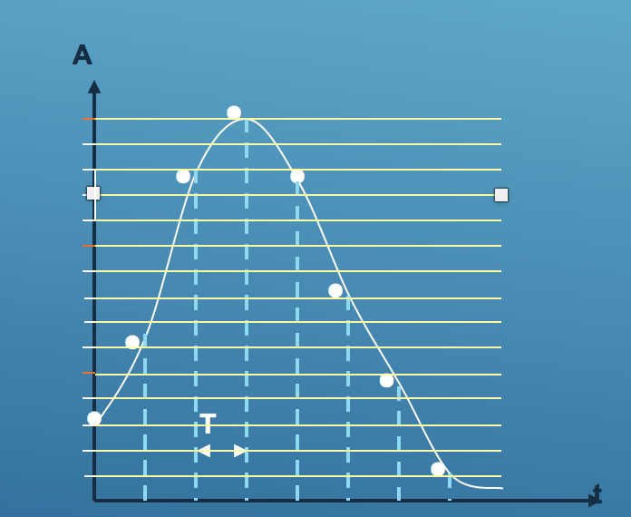
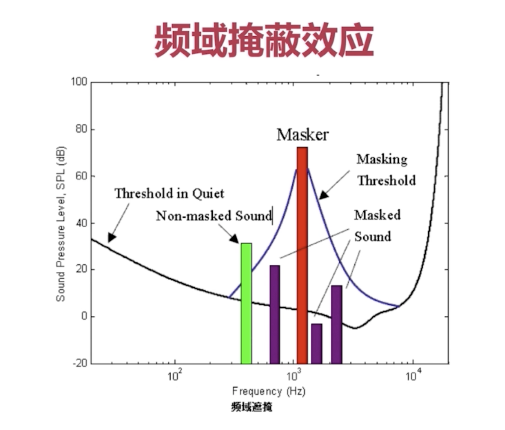
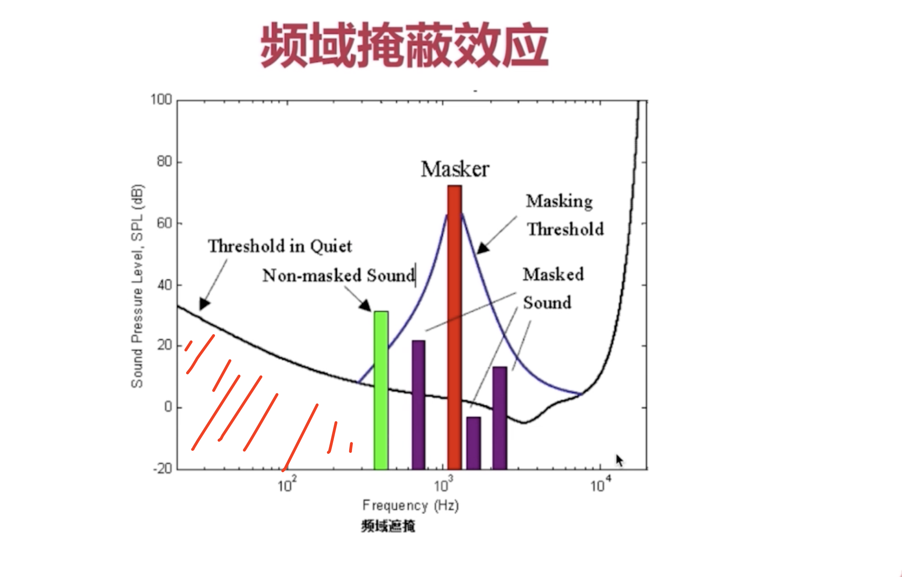
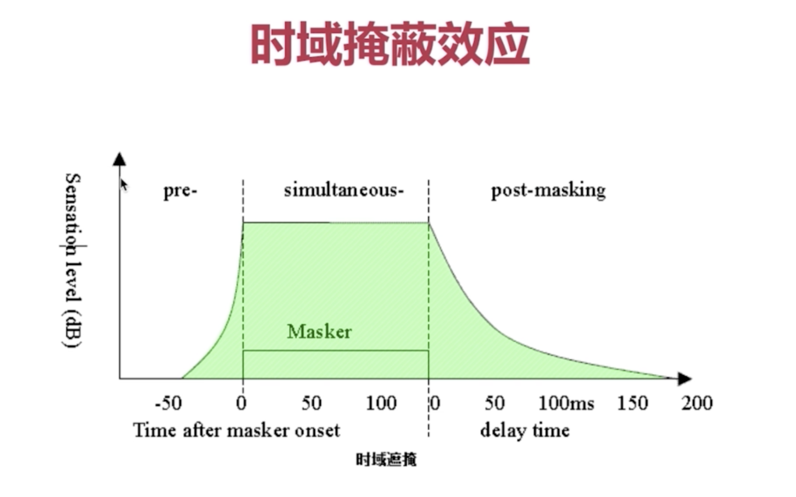
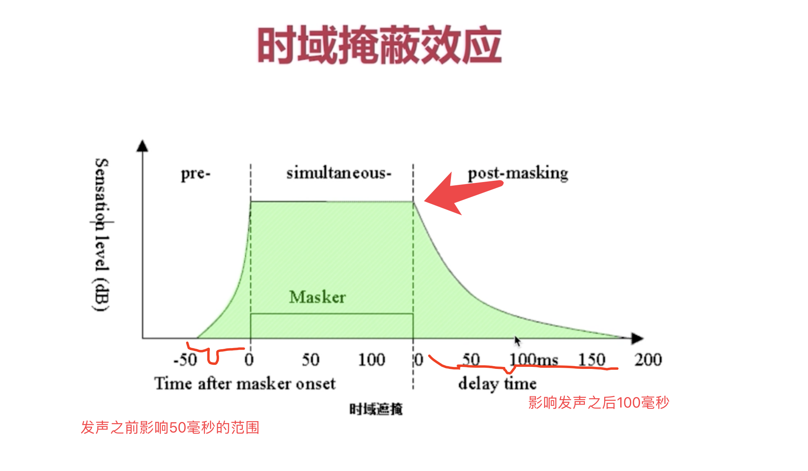
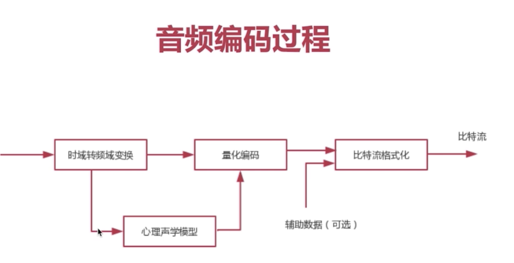
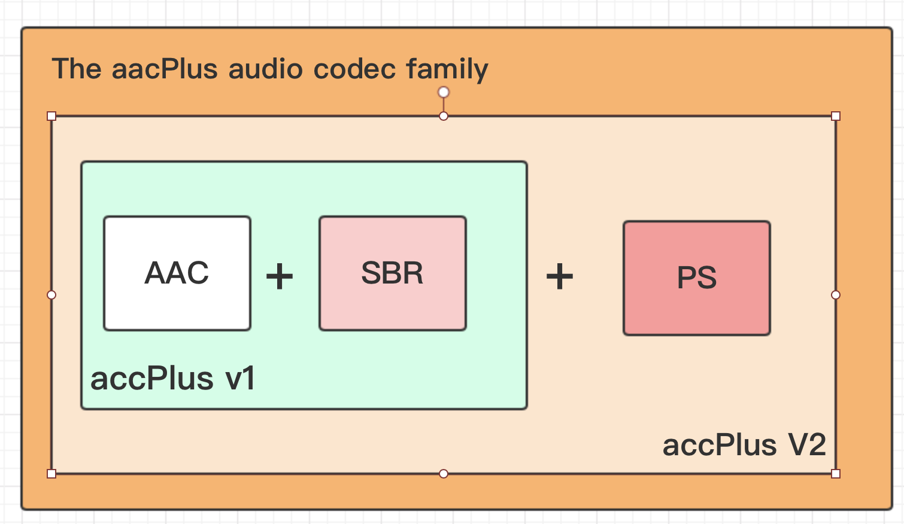

这一章介绍音视频的基础概念, 包括音视频的基础数据格式, 编码后的数据格式,以及不同格式之间的相互转换...(ps: 如何阅读"本书"的话)

# 1.1 声音的物理性质

一句话小结: 声音是波, 声波有三要素`频率`、`振幅`、`波形`, 人耳听力范围:20Hz~2kHz, 人耳对3~4kHz频率范围内的声音敏感,.

- 频率: 代表音阶的高低
- 振幅: 代表响度
- 波形: 代表音色

# 1.2 数字音频

- 关键词: `模拟信号数字化`,`采样`, `量化`, `编码`, `PCM(脉冲编码tiao'zhi)`, `量化格式(sampleFormat)`, `采样率(sampleRate)`, `声道数(channel)`

- 采样:`奈奎斯特定理就`是就是`采样定理`: 说的按比声音最高频率高`2倍以上`的频率对声音进行采样(也称AD转换), 从而使得经过数字化处理之后, 人耳听到的声音质量不会被降低.
  - 人耳听力范围:20Hz~2kHz, 所以采样频率是44.1kHz
  - 44.1kHz代表1秒回采样44100次.
  - 采样频率就是: 一秒采几个`点`

- 量化: 针对每个`点`来说的, 上面说什么`44.1kHz`说的是1秒钟采样44100次, 就说1秒钟采了44100个点了, 每一个点用1,200,还是23来表示就是量化的事.

- 编码: 所谓编码,就是按照一定的格式记录采样和量化后的数字数据, 比如顺序存储或压缩存储....

`采样深度`, `采样精度`, `量化格式(本书)`, 是一个东西.

- 采样精度(sampleFormat): 1般说的是多少多少位, 8位, 16位
  - 8位=1个字节==2的8次方,可以表示256个数, 也就是256个等级每个采样点数字化表示就256等级中的某一个.
  - 16位=2个字节==2的16次方, 可以表示65536个数, 65536个等级.

- 采样率(sampleRate): 说每秒采样多少个点, 44.1kHz = 44100, 就是说1秒钟采44100多个点

- 声道(channel): 单声道1, 双声道2

- PCM就是裸数据 =  sampleFormat *  sampleRate *  channel;
  - 说44.1kHz的采样率,双声道,采样精度是2字节, 一秒钟有多少PCM数据; 
    - 44100*2*16 = 141120 bit = 176400字节

PS: AAC一般用44.1k的采样

# 1.3 音频编码

关键词: `掩蔽效应`, `频域掩蔽效应`, `时域掩蔽效应`, `音频压缩技术`, `冗余数据`

## 频域掩蔽效应图解

x轴是频域,就是音频的高低, 越往右音频越高
y轴是我的声响, 越往上声音越大
原点就是20Hz的点, 20Hz以下我们是听不到的, 20kHz人也听不到, 所以不在20Hz~20kHz的我们全不要, 那么在20Hz~20kHz这里面的声音我们都能听到吗? 实际也不一定, 这跟声音的大小由密切关系.

图中小于40分贝的我们听不到, 

图中紫色部分, 在某个频域突然一个高声(红那个)出现, 那么紫色的就听不见了, 两个人吵架, 嗓子尖声音又大的肯定把嗓子也尖但是声音较小的压下去, 我们就听不见声音小的那个的了.

如果是一男的跟一女的吵, 好比绿色那个跟红色那个, 男生的音频小一点, 离高音(红色那个)就有一定距离, 女的很高的声音男的不是很高(但是超过一定范围,), 但那时男的声音是能被大家所听到的.

频率较为接近的分贝大的能把声音低的遮蔽掉, 频率有一定距离, 超过某一范围也能听到. 大的声音周边有些小的声音我们也可以去掉. 

## 时域掩蔽效应

x是时间轴
y轴是声音的大小.
说在一个持续的时间内, 那么有一个比较高的声音和一个比较低的声音, 比较低的就被屏蔽掉了

## 

# AAC介绍

MPEG-4 标准出现后, AAC加入了SBR技术, 和PS技术
目前常用的规格有AAC LC, AAC HEV1, AAC HE V2

## AAC规格描述

- AAC LC : (Low Complexity)低复杂度, 码流128k

- AAC HE : AAC LC + `SBR (Spectral Band Replication)`, 码流64k
	-  SBR: 分频复用, 将音频的频带分成两部分, 低频和高频, 分别对他们进行编码, 对于低频的以前如果采样率是44.1k,就是每个正玄波采样2000次, 采样2000次就完整的记录下原来的模拟的声波,但是又太多了没必要,只需要记录主体就可以了, 就将采样率减少,   

  - 对于高频的, 20000Hz的, 以前如果我们是安装44.1k采样, 一个正玄周期只采了两个采样, 那么对于高频的保真性就很差, 而采用了`SBR`技术了,我们就增加高频的采样,保证高频的音质, 这样一是降低了码率第二又提高了音频的质量. 

- AAC HE V2 : AAC LC + SBR + `PS( Parametric, Stereo)` 码流32k
  - PS( Parametric, Stereo): 简单的说就是, 我们把双声道分别保存,  双声道一个声道的数据完整保存,另一个声道只存一些差异的东西, 之所以可以这么干是因为音频两个声道的声音的相关性非常强,

## AAC格式

- ADIF (Audio Data Interchange Format)
  - 这种格式只能从头开始解码, 常用在磁盘文件中
  - 说:我们有一个AAC的文件, 我们只要在这个文件的开头存一个很小的头, 里面包括采样率呀采样进度声道数啊这些基本能信息,  我们就可以对整个文件进行解读, 没拿出一帧的时候我们就套用头部的参数去解析他,这样就能播放出整个文件.

- ADTS (Audio Data Transport Stream)
  - 这种格式每一帧都有一个同步字, 可以在音频流的任何位置开始解码, 它适用于数据流格式. 
  - 说: ADTS就是在每一个音频帧的前面加一个同步字, 也就是加一个小的头7或9个字节. 这个家伙的好处就是, 流传输的话每收到一个音频帧就可以直接将它解出来, 
  - RTMP协议里, FLY格式文件里都有ADTS

## AAC编码库哪个好?

Libfdk_AAC > ffmpeg AAC > libfaac > libvo_aacenc

# 1.4 图像的物理现象

-  视频是由一幅幅图像组成.

- 说手机屏幕分辨率 1280 * 720,  就是说整个手机屏幕有:1280 * 720那么多个像素点, 每个像素点由三个子像素点组成.

# 1.5 图像的数值表示

引子: 问,一个像素点的RGB改如何表示? 像素里的子像素又该如何表示?

- 浮点表示,: 取值范围为 0.0 ~ 1.0, 比如, 在 OpenGL ES 中对每一个子像素点的表示, 使用的就是这种表达方式.

- 整数表示: 取值范围为 0~255 或者 00 ~ FF , 8个比特表示一个子像素, 32个比特表示一个像素

说 , 对于一副图像, 一般使用整数表示方法进行描述, 比如计算一张 1280 * 720的RGBA_8888图像的大小, 可采用如下:
 - 1280 X 720 X 4  = 3.516MB, 
 - PS: 上面这个也是位图(bitmap), 在内存中所占用的大小, 得出一个结论:每一张图片的裸数据都是很大的. 

一张图都这么大, 在网络中传不靠谱, 咋搞, 压缩....

## 1.5.2 YUV 表示方式

# 1.6 视频的编码方式

# 1.7 小结